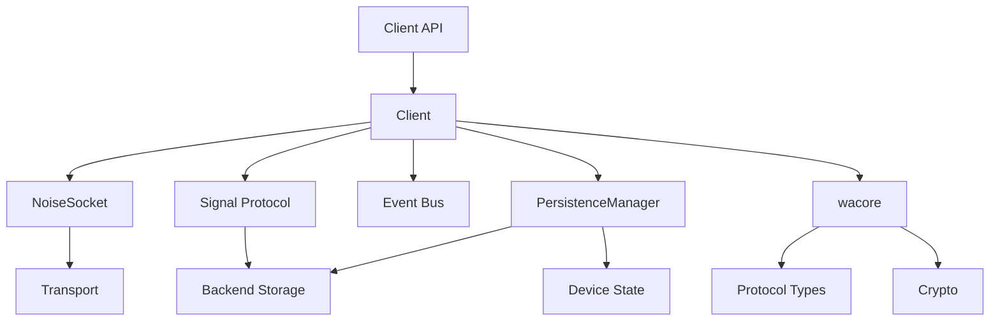
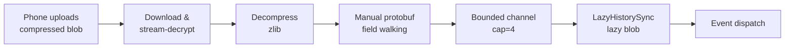
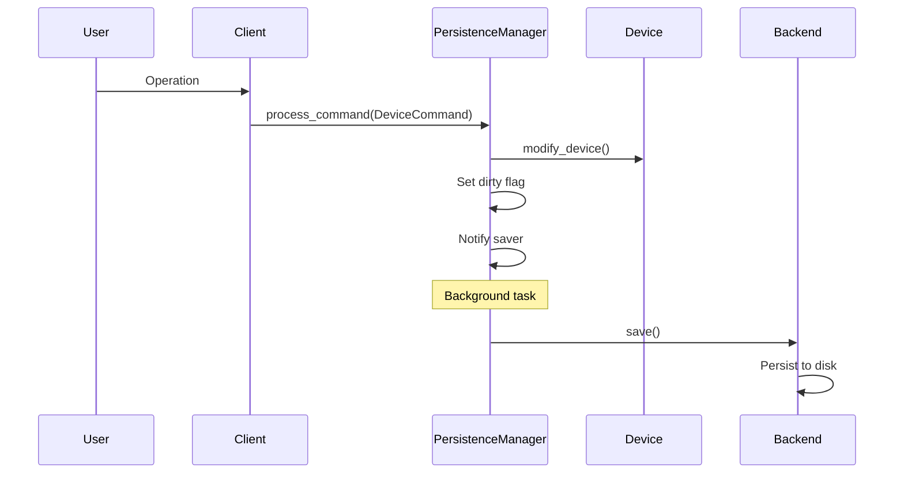

## Overview

WhatsApp-Rust is a high-performance, async Rust library for the WhatsApp Web API. The project follows a modular, layered architecture that separates protocol concerns from runtime concerns, enabling platform-agnostic core logic with pluggable backends.

## Workspace Structure

The project is organized as a Cargo workspace with multiple crates:

```
whatsapp-rust/
├── src/                          # Main client library
├── wacore/                       # Platform-agnostic core
│   ├── binary/                   # WhatsApp binary protocol
│   ├── libsignal/                # Signal Protocol implementation
│   ├── appstate/                 # App state management
│   ├── noise/                    # Noise Protocol handshake
│   └── derive/                   # Derive macros
├── waproto/                      # Protocol Buffers definitions
├── storages/sqlite-storage/      # SQLite backend
├── transports/tokio-transport/   # Tokio WebSocket transport
├── http_clients/ureq-client/     # HTTP client for media
├── tests/e2e/                    # End-to-end test suite
└── examples/                     # Example applications (benchmarks)
```

## Three main crates

### wacore - platform-agnostic core

**Location:** `wacore/`

**Purpose:** Contains core logic for the WhatsApp binary protocol, cryptography primitives, IQ protocol types, runtime abstraction, and state management traits.

**Key Features:**
- **Zero runtime dependencies** — no Tokio, no async-std, only `futures`, `async-trait`, `async-lock`, and `async-channel`
- **32-bit target support** — uses `portable-atomic` for 64-bit atomics with a software fallback on platforms without native `AtomicU64` (ARM32, MIPS, etc.)
- `Runtime` trait for pluggable async executors (Tokio, async-std, WASM, etc.)
- `Transport`, `TransportFactory`, and `HttpClient` traits for pluggable networking
- `Backend` trait for pluggable storage
- Cryptographic operations (Signal Protocol, Noise Protocol)
- Type-safe protocol node builders

**Key Modules:**
```rust
wacore/
├── binary/           // Binary protocol encoding/decoding
├── libsignal/        // E2E encryption
├── noise/            // Noise Protocol handshake
├── appstate/         // App state sync protocol
├── derive/           // Derive macros (EmptyNode, ProtocolNode, StringEnum)
├── iq/               // Type-safe IQ protocol types
├── net.rs            // Transport, HttpClient trait definitions
├── runtime.rs        // Runtime trait + AbortHandle
├── protocol/         // ProtocolNode trait, keepalive, retry
├── time.rs           // Pluggable time provider + portable Instant
├── types/
│   ├── events.rs     // Event definitions
│   └── message.rs    // Message types
└── store/
    ├── traits.rs     // Storage trait definitions (Backend, SignalStore, etc.)
    └── device.rs     // Device state model
```

### waproto - protocol buffers

**Location:** `waproto/`

**Purpose:** Houses WhatsApp's Protocol Buffers definitions compiled to Rust structs.

**Build Process:**

`build.rs` always runs, reads the committed binary descriptor (`src/whatsapp.desc`), verifies its SHA-256, and writes `whatsapp.rs` and `tags.rs` into `OUT_DIR`. Neither generated file is committed. To regenerate after modifying `whatsapp.proto`:

```bash
scripts/regenerate-proto-desc.sh   # updates whatsapp.desc + .sha256
cargo build -p waproto
```

**Generated Types:**
- `Message` - All message types
- `WebMessageInfo` - Message metadata
- `HistorySync` - Chat history
- `SyncActionValue` - App state mutations

### Whatsapp-rust - main client

**Location:** `src/`

**Purpose:** Integrates `wacore` with concrete implementations (Tokio runtime, SQLite storage, ureq HTTP, Tokio WebSocket), provides the high-level `Bot` builder and `Client` API.

**Key Features:**
- `TokioRuntime` — default `Runtime` implementation (gated on `tokio-runtime` feature)
- Typestate `BotBuilder` — compile-time enforcement that all 4 required components are provided
- SQLite persistence (pluggable via `Backend` trait)
- Event bus system
- Feature modules (groups, media, newsletters, communities, etc.)

## Runtime abstraction

The library is fully runtime-agnostic. All async operations go through four pluggable trait abstractions defined in `wacore`:

| Concern | Trait | Default implementation | Crate |
|---------|-------|----------------------|-------|
| Async runtime | `Runtime` | `TokioRuntime` | `whatsapp-rust` (gated on `tokio-runtime`) |
| Network transport | `TransportFactory` + `Transport` | `TokioWebSocketTransportFactory` | `whatsapp-rust-tokio-transport` |
| HTTP client | `HttpClient` | `UreqHttpClient` | `whatsapp-rust-ureq-http-client` |
| Storage | `Backend` | `SqliteStore` | `whatsapp-rust-sqlite-storage` |

The `Runtime` trait requires four methods plus two optional methods with defaults:

```rust
pub trait Runtime: Send + Sync + 'static {
    fn spawn(&self, future: Pin<Box<dyn Future<Output = ()> + Send + 'static>>) -> AbortHandle;

    /// Fire-and-forget spawn. Defaults to `self.spawn(future).detach()`.
    fn spawn_detached(&self, future: Pin<Box<dyn Future<Output = ()> + Send + 'static>>) {
        self.spawn(future).detach();
    }
    fn sleep(&self, duration: Duration) -> Pin<Box<dyn Future<Output = ()> + Send>>;
    fn spawn_blocking(&self, f: Box<dyn FnOnce() + Send + 'static>) -> Pin<Box<dyn Future<Output = ()> + Send>>;
    fn yield_now(&self) -> Option<Pin<Box<dyn Future<Output = ()> + Send>>>;

    /// How often to yield in tight loops (every N items). Defaults to 10.
    fn yield_frequency(&self) -> u32 { 10 }
}
```

`AbortHandle` is `#[must_use]` — dropping the handle aborts the spawned task. Call `.detach()` on the handle for fire-and-forget tasks that should run to completion independently. See [custom backends — AbortHandle](/guides/custom-backends#aborthandle) for implementation details.

As of [#1124](https://github.com/oxidezap/whatsapp-rust/pull/1124), `spawn_detached` exists so fire-and-forget callers no longer have to write `spawn(future).detach()` themselves. The trait-level default above is exactly that call: `self.spawn(future).detach()`. It still builds the `AbortHandle` and immediately drops it, so the default alone saves nothing. That `AbortHandle` boxes a `dyn FnOnce` capturing the executor's own handle — the cost this method exists to avoid. The saving comes from `TokioRuntime`'s own override, which calls `tokio::spawn(future)` directly and never constructs an `AbortHandle` at all. #1124 migrated two of the library's own fire-and-forget spawns to `spawn_detached`: the event-callback dispatcher in `bot.rs`, and the read loop's spawned-processing branch (see [WebSocket handling](/advanced/websocket-handling)). Those two pick up the saving automatically under the bundled `TokioRuntime`. Override `spawn_detached` yourself only if your executor can spawn a task with no cancellation bookkeeping at all.

The `yield_frequency()` method controls how often the client cooperatively yields during tight async loops (such as processing incoming frames). It returns the number of items to process before yielding. The default value is `10`. Single-threaded runtimes should return `1` to avoid starving the event loop, while multi-threaded runtimes can use higher values or rely on `yield_now()` returning `None`.

On WASM targets, `Send` bounds are automatically removed via `#[cfg(target_arch = "wasm32")]`.

The `BotBuilder` uses a typestate pattern with four type parameters `<B, T, H, R>` (Backend, Transport, HttpClient, Runtime). The `build()` method is only callable when all four are `Provided`, making missing-component errors compile-time instead of runtime.

See [custom backends](/guides/custom-backends) for implementing your own runtime, transport, HTTP client, or storage backend.

## Key Components

### Client

**Location:** `src/client.rs`

**Purpose:** Orchestrates connection lifecycle, event bus, and high-level operations. The synchronization primitive follows the shape of the state, not a single default. State whose critical section awaits uses `async-lock` (runtime-agnostic, not Tokio-specific). State whose critical section never awaits — a clone, a store, a set op — uses a `std::sync` lock instead. State that is built once and never replaced uses `std::sync::OnceLock`. On a path that must produce a `Send` future (e.g. a spawned task), a `std::sync::MutexGuard` isn't `Send`, so holding one across an `.await` there is a compile error rather than something a reviewer has to catch by hand ([#1227](https://github.com/oxidezap/whatsapp-rust/pull/1227)).

```rust
pub struct Client {
    pub(crate) core: wacore::client::CoreClient,
    pub(crate) persistence_manager: Arc<PersistenceManager>,
    pub(crate) media_conn: Arc<RwLock<Option<MediaConn>>>,
    pub(crate) noise_socket: Arc<std::sync::Mutex<Option<Arc<NoiseSocket>>>>,
    // ... connection state, caches, locks
}
```

**Responsibilities:**
- Connection management
- Request/response routing
- Event dispatching
- Session management

### PersistenceManager

**Location:** `src/store/persistence_manager.rs`

**Purpose:** Manages all state changes and persistence.

```rust
pub struct PersistenceManager {
    device: Arc<RwLock<Device>>,
    backend: Arc<dyn Backend>,
    dirty: Arc<AtomicBool>,
    save_notify: Arc<Notify>,
}
```

**Critical Pattern:**
- Never modify `Device` state directly
- Use `DeviceCommand` + `process_command()`
- For read-only: `get_device_snapshot()`

### Signal Protocol

**Location:** `wacore/libsignal/` & `src/store/signal*.rs`

**Purpose:** End-to-end encryption via Signal Protocol implementation.

**Features:**
- Double Ratchet algorithm
- Pre-key bundles
- Session management
- Sender keys for groups

### Socket & Handshake

**Location:** `src/socket/`, `src/handshake.rs`

**Purpose:** WebSocket connection and Noise Protocol handshake.

**Flow:**
1. WebSocket connection
2. Noise handshake (XX pattern)
3. Encrypted frame exchange

## Module Interactions



## Layer Responsibilities

### wacore layer (platform-agnostic)

- Protocol logic
- State traits
- Cryptographic helpers
- Data models

**Example: IQ Protocol**
```rust
// wacore/src/iq/groups.rs
pub struct GroupQueryIq {
    group_jid: Jid,
}

impl IqSpec for GroupQueryIq {
    type Response = GroupMetadataResponse;
    fn build_iq(&self) -> InfoQuery<'static> { /* ... */ }
    fn parse_response(&self, response: &NodeRef<'_>) -> Result<Self::Response> { /* ... */ }
}
```

### Whatsapp-rust layer (runtime)

- Runtime orchestration
- Storage integration
- User-facing API

**Example: Feature API**
```rust
// src/features/groups.rs
impl<'a> Groups<'a> {
    pub async fn fetch_metadata(&self, jid: &Jid) -> Result<GroupMetadata> {
        // Use wacore IqSpec for protocol
        self.client.execute(GroupQueryIq::new(jid)?).await
    }
}
```

## Protocol entry points

### Incoming Messages

**Flow:** `src/message.rs` → Signal decryption → Event dispatch

Incoming stanzas are decoded as `Arc<OwnedNodeRef>` (zero-copy from the network buffer) and routed through per-chat message queues:

```rust
// src/message.rs
pub async fn handle_message(client: &Arc<Client>, node: &Arc<OwnedNodeRef>) {
    // 1. Extract encrypted message from NodeRef
    // 2. Decrypt via Signal Protocol
    // 3. Commit (or accumulate into a batch during the offline drain)
    // 4. Dispatch Event::Messages
}
```

### Outgoing Messages

**Flow:** `src/send.rs` → Signal encryption → Socket send

Outgoing stanzas are built as owned `Node` values via `NodeBuilder`:

```rust
// src/send.rs
pub async fn send_message(client: &Arc<Client>, msg: &Message) {
    // 1. Encrypt via Signal Protocol
    // 2. Build protocol node (owned Node)
    // 3. Send via NoiseSocket
}
```

### Socket Communication

**Flow:** `src/socket/` → Noise framing → Transport

```rust
// src/socket/mod.rs
impl NoiseSocket {
    pub async fn send_node(&self, node: Node) -> Result<()> {
        // 1. Marshal to binary
        // 2. Encrypt with Noise
        // 3. Frame and send
    }
}
```

## Connection Lifecycle

### Auto-Reconnection

The client implements robust reconnection handling with stream error awareness:

```rust
// Client fields for connection and reconnection management
is_connected: Arc<AtomicBool>,                    // Lock-free connection state (Acquire/Release)
pub enable_auto_reconnect: Arc<AtomicBool>,       // Toggle auto-reconnect
pub auto_reconnect_errors: Arc<AtomicU32>,        // Error count for backoff
pub(crate) expected_disconnect: Arc<AtomicBool>,  // Expected vs unexpected
pub(crate) connection_generation: Arc<AtomicU64>, // Detect stale tasks
```

The `is_connected` field uses an `AtomicBool` to track whether the noise socket is established. This avoids a TOCTOU race that previously occurred when `try_lock()` on the noise socket mutex failed under contention, causing false-negative connection checks and silent ack drops.

**Connection timeout:** Both the transport connection and version fetch are wrapped in a 20-second timeout (`TRANSPORT_CONNECT_TIMEOUT`), matching WhatsApp Web's MQTT and DGW defaults. This prevents dead networks from blocking on the OS TCP SYN timeout (~60-75s). Both operations run in parallel via `tokio::join!`.

**Reconnection flow:**
1. Connection lost → `cleanup_connection_state()` (see [disconnect cleanup](#disconnect-cleanup))
2. Check `enable_auto_reconnect` → exit if disabled (401, 409, 516 disable this)
3. Check `expected_disconnect` → immediate reconnect if expected (e.g., 515)
4. Stability-gated backoff reset: the counter resets to base only if the connection was authenticated (`<success>`) for at least 30s (`STABLE_CONNECTION_RESET`, WA Web's `resetDelay`) **and** no explicit penalty (429, manual `reconnect()`) is pending for this cycle — a penalty survives even a stable connection (WA Web `cancelReset`). The stability window is measured against a monotonic clock (`connected_at`, a `wacore::time::Instant`), so a system clock jump can no longer make a young connection look stable or a genuinely stable one look young ([whatsapp-rust#1379](https://github.com/oxidezap/whatsapp-rust/pull/1379)).
5. Calculate Fibonacci backoff delay (1s, 1s, 2s, 3s, 5s, 8s... max 900s with +/-10% jitter)
6. When you call `disconnect()`, `logout()`, or `signal_shutdown_sync()`, the client interrupts the backoff immediately and returns from `run()`. If the delay completes first, it attempts reconnection with a 20s connect timeout.

See [WebSocket & Noise Protocol - Fibonacci backoff](/advanced/websocket-handling#fibonacci-backoff) for the stability-reset and penalty-survival mechanics, and for the counter's saturation at 64 consecutive failures ([whatsapp-rust#1410](https://github.com/oxidezap/whatsapp-rust/pull/1410)).

### Pause / resume

Added in PR #1265. `Client::pause()`/`resume()` fill the gap between `disconnect()` (terminal — no way back for that `Client`) and `reconnect()` (comes back on the library's own schedule). `pause()` drops the connection and parks the `run()` supervision loop until `resume()` releases it, on the caller's own timeline. The client is not terminal while paused; it is between connections, on purpose — see point 6 below for the one case where a pause still ends the loop.

```rust
// Client fields backing pause/resume
pub(crate) paused: AtomicBool,                       // Set by pause(), cleared by resume()
pub(crate) pause_state_notifier: Arc<event_listener::Event>, // Fired only by pause()/resume()
pub(crate) pause_teardown_pending: AtomicBool,        // One-shot: the ending connection owes no backoff
pub(crate) pause_generation: AtomicU64,               // Bumped by every pause(); attempts capture it once
pub(crate) connection_publish: Mutex<()>,             // Serializes pause()'s teardown against connect's publish
```

**Mechanics:**
1. `run()`'s loop checks `paused` at the top of every iteration, before each connect attempt, not only after one ends. A `pause()` can land as easily during a reconnect backoff as during a live connection. Finding `paused` set, the loop logs and parks on `wait_while_paused()`. That helper re-checks `paused`/`is_running` against `session_state_notifier`, so a `disconnect()` mid-pause still ends the loop instead of waiting for a `resume()` that is never coming.
2. `connect()` itself refuses with `ConnectError::Paused` up front. The connect graph also re-checks a `connect_refusal()` (shutdown-or-paused) at every checkpoint — before the transport opens, after the handshake, and at the final publish — comparing the connection attempt's captured `pause_generation` against the current one. That generation compare, not just the `paused` flag, is what catches an attempt that spanned a `pause()` **and** a `resume()` while it was mid-handshake: a level-triggered read of `paused` alone would see `false` and let it through.
3. The final refusal-check-and-publish in the connect graph and `pause()`'s own capture of what it is tearing down share the `connection_publish` mutex. A `pause()` can therefore never read "no connection" from an attempt one statement away from publishing one.
4. `pause_teardown_pending` is a one-shot fact, not a live re-read of `paused`. It's set by whichever path ends the connection — the run loop's `ConnectError::Paused` branch, or `pause()` itself — so a `resume()` landing in the gap between the teardown starting and the run loop noticing does not leave the loop believing the ending connection deserves the ordinary Fibonacci penalty.
5. `resume()` is synchronous and deliberately does not wait on a `pause()` still in flight. That teardown ends in an untimed socket close, and queuing behind it would make "come back on my word" hostage to an unresponsive transport. `resume()` just clears `paused`, fires `pause_state_notifier`, and lets the run loop reconnect immediately.
6. The `enable_auto_reconnect` check in `run()`'s post-connection logic runs *before* the `pause_teardown_pending`/`paused` check that would otherwise park the loop. So if `enable_auto_reconnect` was already `false` when `pause()` ended a connection (or interrupted an in-flight attempt), the loop takes the auto-reconnect-disabled branch instead: it calls `stop_supervision_loop()` and exits for good, the same as an ordinary auto-reconnect-disabled disconnect. `is_terminal()` reads that combination (`!enable_auto_reconnect && !is_running && !is_connected`) as terminal, so the "not terminal" guarantee in the overview above holds only while `enable_auto_reconnect` stays set.

**What paused reachability means:** `pause()` publishes the `paused` flag *before* it flushes and closes the socket. `can_reach_server()`, `wait_for_socket()`, and `wait_for_connected()`/`is_fully_ready()` all treat a paused client as unreachable for that whole teardown window, not just once the socket is actually down — otherwise a caller could be handed the very connection the application just asked to close. `await_connection` is the one place that deliberately keeps waiting through a pause rather than giving up. It already waits out a 900s backoff the same way. Nothing on the next connection re-issues a consumer's task, so giving up early would drop the work instead of merely deferring it.

`pause()` does **not** dispatch `Event::Disconnected` (same reasoning as `reconnect()` — the application asked for this, so it isn't news), and it is not a protocol-level presence change. Its interaction with `enable_auto_reconnect` (mechanics point 6 above) is the same ordering that lets `handle_stream_error` make a client terminal (409, 516) through that flag without a pause racing ahead of it.

See [pause() / resume() in the Client API reference](/api/client#pause) for the caller-facing contract.

### Disconnect cleanup

When a connection is lost or `disconnect()` is called, `cleanup_connection_state()` resets all connection-scoped state to prevent stale data from leaking into the next connection. It runs from `run()` after the message loop exits (and `disconnect()` also invokes it directly); the function is idempotent and race-tolerant, so it is not duplicated inside the message loop on transport disconnect events and resetting twice is harmless:

| Resource | Action | Reason |
|----------|--------|--------|
| Transport, events, noise socket | Set to `None` | Release connection resources |
| `is_connected` | Set to `false` (Release ordering) | After socket is `None` so no task sees connected with a cleared socket |
| `chat_lanes` | Invalidated | Drop per-chat queue senders so workers exit via channel close — prevents stale workers from the old connection surviving reconnects with outdated signal/crypto state |
| `pending_retries` | Cleared | Stale keys from detached scope guard cleanup would otherwise suppress the first retry after reconnect |
| `pending_lid_refreshes` | **Deliberately not cleared** | A `scopeguard` releases each key on drop as well as on completion. A refresh whose query dies with the socket already frees its own key, so there is nothing stale left to sweep. Clearing the set here would instead drop a reservation belonging to a live task: a refresh spanning a reconnect would release a key the new connection had since taken. The next `<ack refresh_lid="true">` for that peer would then fire a duplicate outbound `LidQuerySpec` re-resolve — the duplicate the set exists to prevent ([#1313](https://github.com/oxidezap/whatsapp-rust/pull/1313)) |
| `signal_cache` | **Flushed, then settled entries cleared** | Pending identity / session / sender-key writes are persisted to the backend before eviction. If the flush fails, the cache is kept (not cleared) so dirty state survives. Even after a successful flush, an entry a concurrent write touched in the gap stays resident — only fully-settled entries are evicted. |
| `response_waiters` | Drained | Pending IQ waiters fail fast with `InternalChannelClosed` instead of hanging until the 75s timeout |
| Offline sync state | Reset | Counters, timing, and semaphore replaced with fresh single-permit instance |
| Dead-socket timestamps | Cleared | Prevents stale values from triggering an immediate reconnect on the next connection |
| `app_state_key_requests`, `app_state_syncing` | Replaced with empty maps | Prevents unbounded growth across reconnections |
| Noise sender task | Stopped via `NoiseSocket::abort_sender()` | Cuts a send parked on a dead transport short instead of leaving it to the last `Arc` clone, so the bounded close below can't queue behind it |
| Transport | Closed via `Client::close_transport_bounded` (bounded by `TRANSPORT_CLOSE_TIMEOUT`, 2s) | An untimed close shares the transport's sink with every send and can be retried by the kernel for as long as `tcp_retries2` allows (~15 min on Linux); this runs on the caller's thread of control (the run loop, or `disconnect()`'s caller), so an unbounded close parks the whole client |

<Note>
**Bounded teardown ([whatsapp-rust#1410](https://github.com/oxidezap/whatsapp-rust/pull/1410)).** Every teardown path's transport close — `disconnect()`, `reconnect()`, `reconnect_immediately()`, `pause()`, and this cleanup routine — is now bounded by `TRANSPORT_CLOSE_TIMEOUT`. `abort_sender()` runs first, closing the sender task's job channel and aborting it outright; any send it cuts off (queued or already in flight) fails with `EncryptSendError::channel_closed()` rather than hanging — a send racing a teardown was going to fail once the socket closed anyway. See [WebSocket & Noise Protocol — Disconnect](/advanced/websocket-handling#4-disconnect) for the full mechanics.
</Note>

<Note>
Chat lane invalidation is critical for correctness. Without it, stale message processing workers from the previous connection survive reconnects, holding outdated Signal session state that causes decryption failures on the new connection.
</Note>

<Note>
**Flush-before-clear (v0.6).** The signal cache is now flushed to the backend before being cleared on disconnect. Previously the cache was dropped immediately, so a just-advanced sender-key chain that hadn't been persisted yet was lost — on the next send the client would treat the chain as fresh and re-distribute the SKDM to every group device unnecessarily. Disconnect is therefore no longer a "forget all Signal state" operation; it's a "persist, then forget" one. This is a behavior change for anyone relying on the old drop-everything semantics.

**Settled-only eviction.** Teardown now calls `SignalStoreCache::clear_after_flush()` instead of an unconditional clear. A write that lands between the flush releasing its lock and teardown running — e.g. a concurrently raised sender-key reservation — used to be silently discarded, which could let ciphertext reach the wire before its new durability ceiling was ever persisted. Teardown now only evicts a store (sessions, identities, sender keys) once it has no dirty, deleted, checked-out, or pending-wire-gate entries; anything installed after the flush stays resident for the next successful flush to settle. See [Signal Protocol — clean reload vs. crash recovery](/advanced/signal-protocol#clean-reload-vs-crash-recovery) for how this interacts with the counter/iteration lease.
</Note>

**Stream error behavior:**
- **401 (unauthorized)**: Disables auto-reconnect, emits `LoggedOut`
- **409 (conflict)**: Disables auto-reconnect, emits `StreamReplaced`
- **429 (rate limited)**: Adds 5 extra Fibonacci steps to backoff, then reconnects; also suppresses the next stability-gated backoff reset (see above)
- **515 (expected)**: Immediate reconnect without backoff
- **516 (device removed)**: Disables auto-reconnect, emits `LoggedOut`
- **`<xml-not-well-formed/>`** (no numeric code): Force-closes the socket and reconnects with standard backoff — WA Web treats a malformed frame as unrecoverable for the current stream

### Message loop (read loop)

The `read_messages_loop` runs on the `run()` caller's task and uses `select_biased!` to multiplex shutdown signals with transport events. Frame decryption is sequential (noise counter ordering), but node processing uses a hybrid inline/concurrent strategy:

- **Inline**: `success`, `failure`, `stream:error` (connection state), `message` and status-broadcast `status` (arrival order for per-chat queues), `ib` (offline sync tracking)
- **Spawned concurrently**: all other stanzas (receipts, notifications, presence, etc.)

A top-level `<status from="status@broadcast">` stanza carries the same E2EE payload as `<message from="status@broadcast">` — the server can deliver either shape — so it's retagged and routed through the identical inline enqueue path, and acked with `class="status"` plus the local device's own JID. A `<status>` from a `@newsletter` sender is a different shape and keeps the router path instead.

Any top-level stanza the router doesn't recognize is nacked (`NackReason::UnrecognizedStanza`) when it carries both `id` and `from`, rather than left unanswered — see the **Nack on unrecognized stanzas** note in [Offline sync](#offline-sync) below.

After processing a batch of multiple frames, the loop refreshes `last_data_received` so the keepalive loop sees the batch completion time rather than the arrival time — preventing false-positive dead-socket triggers during large offline sync batches. The loop also cooperatively yields every `yield_frequency()` frames to avoid starving other tasks.

See [WebSocket & Noise Protocol - Message loop](/advanced/websocket-handling#2-message-loop-read-loop) for implementation details.

### Keepalive loop

The keepalive loop runs as a **separate spawned task**, fully decoupled from the read loop. This ensures keepalive pings are never blocked by frame processing — even during large offline sync batches that take seconds to drain. The two loops communicate solely through atomic timestamps (`last_data_received` and `first_send_since_recv` — the dead-socket watchdog anchor). Both are monotonic `wacore::time::Instant`s, not wall-clock milliseconds, so a system clock adjustment (NTP resync, waking from suspend) can't be misread as elapsed time and trip the watchdog on a live socket ([whatsapp-rust#1379](https://github.com/oxidezap/whatsapp-rust/pull/1379)). There is no "last send" timestamp: nothing reads one, and stamping every frame written would cost a clock read on the client's hottest path.

```rust
const KEEP_ALIVE_INTERVAL_MIN: Duration = Duration::from_secs(15);
const KEEP_ALIVE_INTERVAL_MAX: Duration = Duration::from_secs(30);
const KEEP_ALIVE_RESPONSE_DEADLINE: Duration = Duration::from_secs(20);
const DEAD_SOCKET_TIME: Duration = Duration::from_secs(20);
```

**Behavior:**
- Sends ping every 15-30 seconds (randomized, matching WA Web's `15 * (1 + random())`)
- Skips ping if data was received within the minimum interval (connection proven alive)
- Sends ping *before* dead-socket check to prevent false-positive reconnects on idle-but-healthy connections
- Waits up to 20s for response
- Checks dead socket on **every** tick (not just after failures) — catches scenarios where pending IQs caused the ping to be skipped, or where the ping succeeded but the connection died immediately after
- Detects dead socket, triggering immediate reconnection, if no data has been received for 20s since the **first** send after the last receive (`first_send_since_recv`) — matching WA Web's `deadSocketTimer.onOrBefore`; subsequent sends do not push this deadline back out
- Fatal errors (`Socket`, `Disconnected`, `NotConnected`, `InternalChannelClosed`) cause the keepalive loop to exit immediately
- Three consecutive transient (`Timeout`/`ServerError`/`ParseError`) failures force `reconnect_immediately()` and exit the loop, rather than pinging forever against a socket that still receives but never answers ([whatsapp-rust#1410](https://github.com/oxidezap/whatsapp-rust/pull/1410))
- The loop exits as soon as `connection_generation` no longer matches the value it was spawned with — the shutdown signal and generation are captured once, at spawn, rather than read from inside the task, since the task's first poll can land after a reconnect has already completed ([whatsapp-rust#1410](https://github.com/oxidezap/whatsapp-rust/pull/1410))
- Error classification is exhaustive and compile-time enforced — adding a new error variant without handling it causes a build failure

See [WebSocket & Noise Protocol - Keepalive](/advanced/websocket-handling#keepalive-and-dead-socket-detection) for detailed keepalive internals.

### Offline sync

When reconnecting, the client tracks offline message sync progress:

```rust
pub(crate) struct OfflineSyncMetrics {
    pub active: AtomicBool,
    pub total_messages: AtomicUsize,
    pub processed_messages: AtomicUsize,
    pub start_time: Mutex<Option<wacore::time::Instant>>,
}
```

**Sync flow:**
1. Receive `<ib><offline_preview count="N"/>` → start tracking, reset counters
2. Process messages with `offline` attribute → increment counter
3. Receive `<ib><offline/>` → sync complete
4. Emit `OfflineSyncCompleted` — or, if the connection ends before step 3, `OfflineSyncInterrupted` (see below)

**Stall timeout (PR #1380):** If the server advertises offline messages via `offline_preview` but stops sending stanzas before the end marker (`<ib><offline/>`) arrives, an inactivity watchdog forces completion — mirroring WhatsApp Web's `ShiftTimer` / `OFFLINE_STANZA_TIMEOUT_MS`. The watchdog arms with the first batch request and re-arms on every offline stanza; because it compares a counter across a sleep rather than reading a clock per stanza, it fires somewhere in `[60s, 120s)` after the last one, not at a fixed 60 seconds. On expiry the client logs a warning, completes the drain with the count actually processed, and `OfflineSyncCompleted` fires — but only while the connection that owns the drain is still up.

**Interrupted resume (PR #1380):** A resume that ends because its connection drops — rather than because the end marker arrived or the stall timer fired — never claims completion. Every path that tears down connection-scoped state (`connect()`'s reset, `cleanup_connection_state()`, and the internal waiters' own generation checks) reports the drain's end by emitting `Event::OfflineSyncInterrupted { total, delivered }` exactly once, so a consumer watching only for `OfflineSyncCompleted` no longer mistakes silence for either success or failure. The event itself says nothing about what gets redelivered — that still follows the pre-existing commit-batch ack contract, unchanged by this PR: see [Inbound Durability → Batching](/advanced/inbound-durability#batching) for exactly which batch a mid-drain disconnect does and doesn't redeliver on the next connection's `offline_preview`. See [`OfflineSyncInterrupted`](/concepts/events#offlinesyncinterrupted).

**Concurrency gating:** During offline sync, the client restricts message processing to a single concurrent task (1 semaphore permit) to preserve ordering. Once sync completes — either by the server end marker, all expected items arriving, or timeout — the semaphore is expanded to 64 permits, switching to parallel message processing.

<Note>
The drain→live transition also flushes the tail of the [inbound commit batch](/advanced/inbound-durability#batching): the last accumulated batch of decrypted messages commits (buffer → Signal flush → durability hook → acks → `Event::Messages`) before the semaphore widens, so no live-mode message is processed ahead of it. If that tail commit fails, the transition is deferred and retried every 3 seconds while the client stays in single-permit drain mode; `OfflineSyncCompleted` still fires immediately so startup waiters are not blocked on the retry.
</Note>

**Semaphore transition safety:** When the semaphore is swapped from 1 to 64 permits, tasks that were already waiting on the old semaphore must not be silently dropped. The client uses a **generation-checked re-acquire loop** to handle this transition safely:

1. Each semaphore swap increments an atomic `message_semaphore_generation` counter
2. When a task acquires a permit, it checks whether the generation has changed since it started waiting
3. If the generation changed (meaning the semaphore was swapped while the task was blocked), the task drops the stale permit and re-acquires from the new semaphore
4. This loop continues until the task holds a permit from the current-generation semaphore

This prevents a critical issue where `pkmsg` messages (which carry Sender Key Distribution Messages for group chats) could be silently dropped during the offline-to-online transition. Without this safety mechanism, a dropped `pkmsg` would cause all subsequent `skmsg` messages from that sender to fail with `NoSenderKeyState`, since the SKDM they depended on was never processed.

**State reset:** On reconnect or cleanup, all offline sync state is reset (counters, timing, and the semaphore is replaced with a fresh single-permit instance) so stale state does not leak into the next connection attempt — reported first as an interrupted resume, per above, if a drain was still active.

**Pull-batch backlog drain (v0.6):** Offline resume now drives the same pull-batch loop WA Web uses to drain the backlog: stanzas that the client can't process (unrecognized `<enc type>`, known-but-empty `<enc>` content, duplicates, ciphertexts that decrypt-fail terminally) are transport-acked alongside their retry receipt so the server stops re-delivering them. Before this, such a stanza fell through `classify_incoming_message` silently, so the server kept replaying it from the offline queue every reconnect until `<stream:error>` closed the stream. The drain logic also acks duplicate-message PDOs that previously hit the silent-drop branch in `handle_decrypted_plaintext`, and preserves the original `recipient` attribute (via `Client::spawn_node_transport_ack`, which echoes the raw `NodeRef` instead of rebuilding from `MessageInfo`) so LID-routed offline stanzas don't trigger `<stream:error>` on the ack.

<Note>
The Meta AI bot's `msmsg` (`<enc type="msmsg">`) encryption type was the original motivating case for this drain — it could not be decrypted, only acked. Since the bot-secret decryption landed (see [Bot message decryption](/api/signal#bot-message-decryption-msmsg)), `msmsg` stanzas are decrypted and dispatched as normal `Event::Messages`; the drain still covers genuinely unrecognized or undecryptable enc types.
</Note>

**Nack on terminal decrypt failure:** When a ciphertext exhausts retries (`max-retry` reached in the PDO recovery state machine), the client now emits a `<nack reason="…">` carrying a structured `NackReason` code instead of silently dropping the message. The full set of 21 codes (`ParsingError`, `InvalidProtobuf`, `MissingMessageSecret`, etc.) mirrors WA Web's reason set so the server stops retransmitting once it sees a terminal nack — see [Protocol → Nack reasons](/advanced/binary-protocol#nack-reasons).

**Ack SKDM-only session decrypts:** A `pkmsg`/`msg` that decrypts successfully but carries only a Sender Key Distribution Message (no user-facing content to dispatch) is now explicitly acked. Previously it could decrypt, skip event dispatch, and leave no ack — so the server kept replaying it from the offline queue. The fix closes that gap so SKDM-only stanzas drain like any other processed message.

**Nack unparseable message stanzas:** A `<message>` stanza whose required `id`/`from` attrs (and `participant`, for group/status messages) are missing or carry an invalid JID now gets an immediate `<ack error="487">` (`NackReason::ParsingError`) instead of a bare warning log and silent drop. `parse_message_info` itself became fail-fast for the same fields — it no longer falls back to a lenient default JID. Consumers driving their own ack/nack flow for intercepted stanzas can reach the same typed responses via `Client::acknowledge_stanza`/`reject_stanza` — see [Manual stanza acknowledgement](/advanced/binary-protocol#manual-stanza-acknowledgement).

**Top-level `<status>` stanzas are handled and acked.** The server can deliver E2EE status updates as a top-level `<status from="status@broadcast">` stanza instead of wrapping them in `<message from="status@broadcast">`. This shape differs from `<message>` only in its tag, so the client retags it and runs it through the same pipeline, and acks it with `class="status"` (the class the server names in the corresponding `<stream:error><ack class="status"/></stream:error>`) plus the local device's own JID, matching WA Web's `sendAck`. Before this, the tag went unhandled — the stanza was neither processed nor acked, so the server kept redelivering it and periodically recycled the stream to demand the ack it was owed.

**Nack on unrecognized stanzas:** Answering nothing at all when the stanza router doesn't recognize a top-level tag is what let one unhandled `<status>` stanza (above) stall a stream for days — the server queued it forever and cycled the connection roughly every 50 minutes asking for its ack. Any stanza the router declines now gets `<nack reason="…">` with `NackReason::UnrecognizedStanza` when it's addressable (`id` and `from` present, the same guard WA Web's `createNackFromStanza` uses); the nack replaces the deferred ack, so the server never gets both for one stanza. This only fires for a tag with no handler at all — see [Protocol → Nack reasons](/advanced/binary-protocol#nack-reasons).

### Critical app-state sync (pairing bootstrap)

Right after a fresh pairing (and on any reconnect before the account's critical app-state collections have synced), the client fetches the `CriticalBlock` and `CriticalUnblockLow` collections — blocked contacts and push name — via a batched IQ. Decoding those snapshots requires the app-state **sync-key-share**, an E2E message the primary phone sends automatically, which can arrive late if a heavy history sync is saturating the stream at the same time.

**A single 180-second deadline** (`CRITICAL_SYNC_TIMEOUT_SECS`, matching WhatsApp Web's `WAWebSyncBootstrap`) bounds the whole critical-sync path:

1. A watchdog task is armed first against this deadline, before anything else runs. As of PR #1291, the watchdog no longer owns retrying a bad answer (see below) — its only job is to force a reconnect if the batched sync produces *no* answer at all within the window, for example a request that never gets an IQ response. Whichever of the sync and the watchdog settles first claims the outcome; the other stands aside rather than fight over the same reconnect.
2. The client waits up to 10 seconds (`KEY_SHARE_GRACE_SECS`) for the auto-shared key before running the batched critical-collections IQ. This grace period is purely an optimization to skip a redundant explicit key request in the common fast case — it does not gate correctness.
3. If a collection still can't be decoded because its key hasn't landed, the client sends an explicit `AppStateSyncKeyRequest` — fanned out to every discovered companion device the same way as the non-critical path below — and waits for the re-share. For this initial critical bootstrap, the wait is bounded by whatever time remains on the shared 180s deadline (rather than a short fixed wait), so a key that arrives late — or is never auto-shared at all — still has a chance to recover on the same connection instead of failing the sync outright.

**The batched critical-collections IQ reports a per-collection outcome** — synced, fatal (the server refused the collection outright with an IQ-level error code, e.g. `400`/`404` — terminal for this connection, not permanently), retryable, or skipped (another in-flight sync or patch send already held it) — rather than a bare success/failure. As of PR #1291, every shape the batch can come back in now reaches the same conclusion: **the connection gets announced.** By the time this sync runs, `set_passive(false)` has already gone out and the socket is delivering offline stanzas, so withholding `Connected` would leave a consumer with no signal that anything had connected while messages kept arriving. What didn't sync is reported instead, and retried in the background rather than by holding the announcement hostage to it:

- **All synced:** the client dispatches `Connected` and the watchdog is cancelled.
- **Any collection fatal:** repeating the request on this connection would get the same answer, so the client stops waiting on it, dispatches `Connected` anyway, and follows it with [`Event::AppStateSyncFailed`](/concepts/events#appstatesyncfailed) (`connected: true`).
  - A fatal outcome does not retry on its own connection. Recovering that collection needs a fresh connection — WhatsApp Web's `COMPANION_SYNCD_SNAPSHOT_FATAL_RECOVERY` path is explicitly gated off for `critical_block`. This client now implements that escalation (see [Peer snapshot recovery](#peer-snapshot-recovery) below) for `critical_unblock_low` and the non-critical collections, but not here: it answers a snapshot MAC that fails local verification, a different failure from the IQ-level `400`/`404` refusal this bullet covers, so a batch that comes back `Fatal` still has no automatic recovery on this connection regardless of which collection it names.
  - The account is usable in the meantime, but missing whatever that collection carries. `critical_block` includes the `setting_pushName` mutation, so presence stays unavailable until the next connection syncs it — unless the push name was already known some other way (e.g. `Bot::with_push_name`, or learned earlier via history sync or a prior session).
  - WhatsApp Web instead notifies the primary device and logs out on a fatal `critical_block`; this client does not end a session on its own.
- **Retryable and/or skipped collections outstanding** (a transient error, or another writer holding the collection — including a batch that failed transport-side before producing any per-collection buckets, which is reported as every requested collection being retryable): the client dispatches `Connected` and [`Event::AppStateSyncFailed`](/concepts/events#appstatesyncfailed) (`connected: true`) the same way, then hands the leftovers to the background sync that follows the bootstrap. Both buckets get one more attempt as part of that sync's own batched request; whatever is still `retryable` after that enters the same bounded backoff every background app-state retry uses — up to `APP_STATE_RETRY_MAX_ROUNDS` (8) rounds doubling from 1 second (a theoretical one-hour cap the round limit never lets it reach, so in practice up to ~128 seconds) — roughly a four-minute window — before giving up and emitting a final `AppStateSyncFailed` for whatever is still unsynced. A round spent waiting for a socket (no connection to retry over) isn't charged as an attempt. A `skipped` collection isn't itself re-queued into that scheduler, matching the non-critical case described below — the equivalent work is understood to be happening via whichever operation already holds it.
- **Nothing answers at all within the 180s deadline** (the batched sync itself never returns): the watchdog fires and forces a reconnect. This is the one shape left that can't announce a connection, because there is no answer to announce; the next connection runs the critical bootstrap again from the top.

A connection is only actually announced if it's still live and authenticated when the sync finishes. If the generation has been retired by then — a replacement connection has already taken over — neither `Connected` nor the failure report fires for this one; the replacement reports for itself once its own sync finishes. If instead the client has been asked to pause or disconnect, or the server has since rejected the session (429/503, which clear login state inline without tearing down the socket), `Connected` is withheld but [`Event::AppStateSyncFailed`](/concepts/events#appstatesyncfailed) still fires with `connected: false`, and the leftovers still go to the background sync. WhatsApp Web logs out (`socketLogout`) when the critical sync doesn't close cleanly; this client keeps the session and reports the gap instead.

Non-critical app-state sync (background regular collections, group `server_sync`, and the `ib` dirty-resync path) is unaffected by this deadline — those callers keep waiting up to 10 seconds (`APP_STATE_KEY_REQUEST_TIMEOUT`) for a missing key before giving up and re-syncing on a later cycle. That request fans out concurrently to every other device on the account (discovered via the same usync device-list lookup used for message routing, current device excluded), falling back to the known primary alone if discovery fails or returns nothing. This dedup-override behavior is shared with the critical bootstrap path (step 3 above): any active wait — critical or non-critical — overrides an existing 24-hour passive dedup stamp for that key, shortening it to a bounded retry window so it isn't starved by an earlier passive request's cooldown. These background syncs report incomplete outcomes through the same `Event::AppStateSyncFailed` event (always with `connected: true`, since the client was already connected). Only their `retryable` collections back off and retry automatically, on the same schedule as the critical path; a `fatal` collection reported this way gets no automatic retry either, and needs the account's next fresh connection.

The net effect: a key-share that's delayed by a saturated stream during pairing no longer strands the critical sync until the 180s watchdog forces a reconnect — it recovers via the explicit request within the same window, so contacts and push name sync reliably on the first connection. And a collection that comes back retryable, refused, or held by another writer no longer strands the connection either — the client connects immediately and reports exactly what didn't sync via `Event::AppStateSyncFailed`, instead of looping a silent reconnect against an answer that, for a refusal, was never going to change. Only the retryable/skipped case actually gets retried in the background; a refusal is reported once and left for the account's next fresh connection to pick up.

<Note>
**Behavior change (PR #1291):** before this, only the "all synced" and "fatal" outcomes above announced the connection. A retryable or skipped outcome — including a batch that failed outright before producing any buckets — used to return in silence: an authenticated, no-longer-passive connection with no `Connected` and no `AppStateSyncFailed`, recoverable only by the 180s watchdog forcing a reconnect. If the server kept refusing or failing the same collection, that reconnect looped forever without ever announcing. A consumer that relied on the eventual reconnect producing a working session now instead gets `Connected` immediately alongside an actionable `AppStateSyncFailed`, and must treat that report as something to act on rather than something to wait out.
</Note>

### Peer snapshot recovery

A snapshot MAC mismatch is the one app-state failure the server can't resolve by retrying: it serves the same bytes every time, they fail local verification the same way, and the collection stays at version 0 forever — so every mutation written to it (a chat marked read, a mute, an archive) keeps refusing with a conflict that can never clear. WhatsApp Web's answer is to ask the primary device to resend the collection outright (`COMPANION_SYNCD_SNAPSHOT_FATAL_RECOVERY`); this client implements the same escalation.

**Trigger.** Applying a synced collection — via the batched sync path or the single-collection patch-send path — raises `AppStateError::SnapshotMACMismatch` or `SnapshotMACMissing`. Both escalate; no other apply failure does (a missing app-state key is answered by a key share instead, and a bad decode by nothing).

**Two exclusions.** `critical_block` is never asked for — rebuilding the block list from a primary that may itself be behind risks talking to someone who was blocked, matching WA Web. And the whole escalation is off when the `enable_peer_snapshot_recovery` ab-prop reads explicit `0`/`false`; the prop simply being absent (this client isn't in WhatsApp's staged rollout) still proceeds, since silence isn't a refusal.

**The ask.** [`Client::request_syncd_snapshot_recovery`](/api/client#request_syncd_snapshot_recovery) sends the collection name to the primary as a fire-and-forget peer (PDO) message — the sync paths call it automatically on a matching failure, and it's public so a caller can invoke it directly. `AppStateProcessor` dedupes per collection: an unanswered request suppresses a repeat for 120 seconds, and once a reply has been claimed and is being applied, that window extends to 900 seconds so the apply itself (an app-state key repair, then up to 450 seconds waiting on the collection's own sync reservation) isn't preempted by its own retry.

**The reply.** The request and the reply both travel as ordinary peer (PDO) messages, over the same Signal-encrypted session as any other device-to-device message — nothing here is sent outside that channel. What's skipped is the *app-state* encryption layer on top of it: `SyncdSnapshotRecovery` carries the primary's version, ltHash, and every mutation's `SyncActionData` **unencrypted at that layer**, so only each record's index MAC needs re-deriving here, from the app-state key. That's what makes a collection recoverable even when its value encryption is precisely what couldn't be followed before. The version and ltHash are written as the primary sent them rather than recomputed, since recomputing them would be this side re-deriving the very value it just failed to agree on. A reply over the `snapshot_recovery_max_mutations_count_allowed` ab-prop (default 2000 records) is refused rather than applied. Correlation is by request id first (the id this client minted for the ask) and by collection name second — nothing else ties an unprompted peer message back to a specific request — so a reply for the wrong collection, or one answering a request that already expired or was superseded, is dropped rather than applied.

Applied mutations dispatch through the same path an ordinary sync uses — the existing `Event::ContactUpdate`, mute, archive, etc. events — so there is no separate event for a recovered collection. What changed is observable via [`memory_report`](/api/client#memory_report)'s `app_state_recovery_requests` field: collections currently awaiting or applying a reply.

### Deferred device sync

During offline sync, the client may receive group messages from devices not yet present in the local device registry (for example, a companion device that was paired while the client was offline). Rather than firing a network request for each unknown device individually, the client batches these into a `PendingDeviceSync` set.

**Flow:**

1. During offline message processing, `is_from_known_device()` detects an unrecognized sender device
2. The sender's user JID is added to `PendingDeviceSync` (deduplicated — each user is queued at most once)
3. A retry receipt is sent so the sender will redeliver the message after the device list is updated
4. When `<ib><offline/>` arrives (offline sync complete), the client waits 2 seconds (`OFFLINE_DEVICE_SYNC_DELAY`, matching WhatsApp Web)
5. All batched user JIDs are flushed in a single bulk usync request via `flush_pending_device_sync()`
6. If the flush fails, the JIDs are re-enqueued for the next attempt

This batching approach minimizes network overhead — instead of N individual usync requests for N unknown devices, a single bulk request resolves all pending users.

When online (not during offline sync), unknown devices trigger an immediate background usync request instead of being batched.

```rust
// src/pending_device_sync.rs
pub(crate) struct PendingDeviceSync {
    pending: std::sync::Mutex<HashSet<Jid>>,
}
```

The `PendingDeviceSync` state is cleared on reconnect to prevent stale entries from leaking across connections.

The `<devices><update hash="…"/></notification>` hash-only path described in [Storage → Granular cache patching](/concepts/storage#granular-cache-patching) resolves its target contact and joins this same `schedule_unknown_device_sync()` batching — offline resumes queue it here instead of firing an immediate usync mid-drain.

Location: `src/pending_device_sync.rs`, `src/handlers/ib.rs`, `src/usync.rs`

See also: [Unknown device detection](/advanced/signal-protocol#unknown-device-detection) for the detection mechanism during group message decryption.

## History sync pipeline

History sync transfers chat history from the phone to the linked device. The pipeline is designed for minimal RAM usage through a multi-layered zero-copy strategy.

### Processing flow



### RAM optimization layers

1. **Heuristic pre-allocation with `compressed_size_hint`** — the decompression buffer is pre-allocated using a 4x multiplier on the compressed blob's `file_length` (clamped to 256 bytes – 8 MiB). When the notification provides `file_length`, this avoids repeated `Vec` reallocation during decompression. The hint comes from the decrypted (but still compressed) blob size, which is a better estimate than the encrypted size that includes MAC/padding overhead
2. **Compressed bytes retained** — after streaming extraction, the original compressed input is handed back as the event payload. Queued events cost O(compressed) rather than O(decompressed). Peak extraction memory is approximately the largest single conversation
3. **Hand-rolled protobuf parser** — instead of decoding the entire `HistorySync` message tree (which allocates every nested message), the core walks varint tags manually and only extracts field 2 (conversations) and field 7 (pushnames)
4. **`Bytes` zero-copy slicing** — decompressed data is wrapped in a reference-counted `Bytes` buffer; each conversation is extracted as `buf.slice(pos..end)`, which is an Arc refcount increment with no per-conversation heap allocation
5. **Bounded channel streaming** — an `async_channel::bounded::<Bytes>(4)` streams conversation bytes from the blocking parser thread to the async event dispatcher, providing backpressure with only ~4 conversations in-flight
6. **`LazyHistorySync` wrapper** — the compressed payload is wrapped in a `LazyHistorySync` with cheap metadata (sync type, chunk order, progress) available without decoding. Full protobuf decoding only happens if the event handler calls `.get()`. Clone is a refcount bump (no cache carried over). Consumers use `.stream()` for memory-bounded incremental decoding, `.decompress()` for one-shot inflation, or `.compressed_bytes()` for zero-copy access to the stored payload
7. **Compile-time callback elimination** — when no event handlers are registered, the callback is `None`, causing the parser to skip conversation extraction entirely at the protobuf level
8. **Secret-presence pre-scan** — before running buffa decode on each `HistorySyncMsg`, a shallow varint walk checks whether the message carries `message_secret` at any level (`WebMessageInfo.message_secret` or `Message.message_context_info.message_secret`). Messages without a secret (the majority in production blobs) are discarded immediately — no struct decode, no allocation. The scan mirrors protobuf merge semantics so repeated field occurrences and malformed bytes are handled identically to a full decode
9. **Shared conversation id** — `HistoryMsgSecretRecord.chat_id` is `Arc<str>`, allocated once per conversation and reference-counted into every record within that conversation (10k clones → 500 on the bench fixture). `msg_id` uses `CompactString` (inline for typical 20–22 char WA IDs) and `secret` uses `SecretBytes` (inline for secrets ≤32 bytes)
10. **Filter-before-materialize retention hook** — `process_history_sync_bytes_filtered` runs a caller-supplied retention predicate against a borrowed `HistoryMsgSecretRecordRef` (a zero-copy view into the not-yet-built record) before allocating the owned, heap-backed `HistoryMsgSecretRecord`. A record the predicate rejects is discarded without ever being materialized. `process_history_sync_bytes` — and `process_history_sync` itself — keep their existing accept-all behavior by wrapping the filtered entry point with an always-`true` predicate, so callers that don't own a retention policy are unaffected. Bench (synthetic 500-conversation blob, upstream PR's rejection-heavy fixture): allocation churn 21.61 MiB → 14.00 MiB, allocation count ~84k → ~26k. The reduction scales with how much of the record set the predicate rejects — the default accept-all behavior sees none of it. See [`wacore` — history_sync types](/api/wacore#history_sync-types) for the exported signatures
11. **Streaming record-visitor path** — `process_history_sync_bytes_with_record_visitor` (closure-based) and `process_history_sync_bytes_with_record_sink` (trait-based, via `HistoryMsgSecretRecordVisitor`) go further than the filter hook above. You can build your own storage row directly from the borrowed `HistoryMsgSecretRecordRef`. This ensures the owned `HistoryMsgSecretRecord` is never allocated, even for accepted records. The visitor trait's optional `reserve` and `retained_item_size` hooks let you size your own collection (e.g., a batched SQL insert buffer) up front. Bench (allocator-instrumented synthetic history extraction): 20.20 MiB → 14.43 MiB allocated (-28.6%); CodSpeed history stream-drain memory: 243.8 KB → 115.2 KB (2.1× less). See [`wacore` — history_sync types](/api/wacore#history_sync-types)
12. **Inline PN↔LID mappings and tctoken candidates, cached group senders** — `HistoryLidMapping.phone_number`/`.lid` and `TcTokenCandidate.id` are `CompactString`, and `TcTokenCandidate.tc_token` is `SmallVec<[u8; 32]>`: typical phone/LID user parts (11–16 digits) and typical tctoken payloads (16–24 bytes) fit inline on 64-bit targets (`CompactString`'s inline capacity is smaller on 32-bit/wasm32, and a longer value in either type spills to the heap), so the PN↔LID harvest — including the two indexes `dedupe_lid_mappings` builds — and the tctoken extraction allocate nothing for typical inputs. The tctoken extraction's chat-kind check now reuses the same borrowed `parse_jid_ref` scan used for the PN/LID guess, instead of building a second owned `Jid` just to read `server`. On the `whatsapp-rust` side, `HistorySecretSeedCollector` caches the previous group message's `(raw participant, Arc<str> sender)` pair — group history arrives in bursts from the same sender, so a repeat of the raw field reuses the cached `Arc` instead of re-parsing the JID and re-rendering it; the cache is keyed on the raw field and cleared on every chat change, so it can't disagree with a fresh resolve. Bench (`bench_process_history_sync`, rebuilt mixed DM/group fixture): 7507 → 3507 allocations (-53%). Deliberate breaking change: `HistoryLidMapping.phone_number`/`.lid` and `TcTokenCandidate.id` move from `String`, and `TcTokenCandidate.tc_token` from `Vec<u8>`. Both new types `Deref` to `str`/`[u8]`, so a call site that consumes them as `&str`/`&[u8]` (method calls, `.parse()`, comparisons against `&str`) still compiles via deref coercion; a call site typed explicitly as `&String`/`&Vec<u8>` does not coerce — see [`wacore` — Allocation optimizations](/api/wacore#allocation-optimizations) for the full migration note ([#1349](https://github.com/oxidezap/whatsapp-rust/pull/1349))

### Skip mode

For bots that don't need chat history, `skip_history_sync()` sends a receipt so the phone stops retrying uploads but downloads nothing. See [Bot - History Sync](/api/bot#history-sync).

## Concurrency Patterns

### Per-Chat Lanes

Prevents race conditions where a later message is processed before the PreKey message. Each chat gets a lane combining an enqueue lock, a worker-liveness lock, and an **unbounded** channel into a single cached entry. Backpressure comes from capping the number of cached lanes rather than messages within a lane: the `chat_lanes` cache itself has a capacity (`chat_lanes_capacity`, default **5,000**) and evicts idle lanes once full. This is a soft cap — a lane with an in-flight message is protected from eviction (see the note below), so if every cached lane happens to be active at once, the map can briefly exceed capacity rather than evicting a live lane and letting a second worker start on the same chat:

```rust
pub(crate) chat_lanes: Cache<Jid, ChatLane>,
// ChatLane { enqueue_lock, queue_tx, worker_running }
// Each queue: async_channel::unbounded::<QueuedChatMessage>()
```

<Note>
**Active lanes survive capacity eviction (v0.6).** Every queued item is a `QueuedChatMessage { node, lane_liveness }`, where `lane_liveness` is a clone of the lane's `enqueue_lock`. The cache's `evict_guard` refuses to evict a lane while any in-flight message still holds that clone (`Arc::strong_count(&lane.enqueue_lock) > 1`); the worker drops its copy only after it finishes processing that message. Previously, a lane could be capacity-evicted right after its worker dequeued a message, and a later stanza for the same chat would then miss the cache and spawn a second worker — letting two workers process the same chat concurrently and out of order. Idle lanes (no in-flight message) remain evictable exactly as before.
</Note>

<Note>
**Idle lane workers self-exit after 60 seconds (v0.7).** A lane's worker awaits the inbound-message handler inline instead of boxing it per message, so the spawned task holds that future's whole state machine (~9 KiB) for as long as the worker runs — message or no message. Left running for the connection's lifetime, that is one such future per chat that ever spoke, bounded only by `chat_lanes_capacity`; an account active in a few thousand groups could park tens of MiB in idle workers, and the capacity-eviction guard above only ever protected *active* lanes from that cost, not idle ones. A worker now closes its queue and exits after `LANE_IDLE_TIMEOUT` (60s) of silence — the idle timer is armed only once the queue is empty, so a busy lane never pays for it. This is independent of the capacity eviction above: an idle worker exits on its own schedule regardless of how much headroom `chat_lanes_capacity` has left.

A message that arrives for a closed lane replaces it. `enqueue_lock` and `worker_running` carry over from the predecessor rather than being re-minted — the chat's enqueue order stays a single total order across the swap (whichever lane generation a handler happened to fetch), and the successor worker takes `worker_running` before processing its first message, so it can never run concurrently with the predecessor still draining whatever raced its idle close.
</Note>

### Per-device session locks

Prevents concurrent Signal protocol operations on the same session. Each device JID gets its own lock, keyed by protocol address strings generated by `to_protocol_address_string()` (format: `user[:device]@server.0`):

```rust
pub(crate) session_locks: Cache<String, Arc<async_lock::Mutex<()>>>,
// Key examples: "5511999887766@c.us.0", "123456789:33@lid.0"
```

The DM send path resolves all known recipient devices and own companion devices from the local device registry, filters out hosted devices, excludes the sender device, and deduplicates for self-DMs — matching WA Web's `WAWebSendUserMsgJob` and `WAWebDBDeviceListFanout` behavior. The local registry is checked first; a network fetch is only triggered on a cache miss to avoid unnecessary LID-migration side effects. Session locks are acquired for all involved devices in sorted order to prevent deadlocks. The `build_session_lock_keys()` helper resolves encryption JIDs (normalizing the recipient to bare form via `to_non_ad()`), sorts by `(server, user, device)` using `cmp_for_lock_order()`, and deduplicates. The `session_guards_for()` helper then takes each device's lock as its mutex is resolved from the sorted JIDs, rather than resolving the whole set before locking any of them (PR [#1131](https://github.com/oxidezap/whatsapp-rust/pull/1131)); acquisition order is still `jids` order, which is what keeps two overlapping sends from deadlocking.

The peer message path (single-device) acquires a single lock for the resolved encryption JID.

<Note>
**Group SKDM fan-out now shares the DM per-device session locks (v0.6).** `prepare_group_stanza`'s pairwise SKDM fan-out (`encrypt_for_devices_with_sessions`) mutates each target device's pairwise Signal session the same way the DM path does, but it was previously only covered by the per-`(group, sender)` sender-key chain lock — a disjoint key from the DM path's per-device session locks. A concurrent DM (or another group send) sharing a device could therefore race that device's pairwise ratchet: both sides load chain index *N* and both store *N+1*, silently dropping one advance. If the lost advance carried the SKDM, that member never received the sender key and every subsequent `skmsg` was undecryptable for it until a retry re-distributed.

`prepare_group_stanza` now acquires the SKDM targets' per-device session locks — via the new `SendContextResolver::lock_device_sessions()` hook, whose `Client` implementation reuses `build_session_lock_keys()` + `session_guards_for()` so both paths serialize on the identical mutexes — before taking the sender-key chain lock, and releases them right after the SKDM fan-out (the `skmsg` chain encrypt that follows only touches the sender-key chain, not any pairwise session). Lock order is always session locks → chain lock on every path, so this cannot introduce a deadlock. The hook defaults to a no-op, so custom `SendContextResolver` implementations (tests, benches) are unaffected unless they opt in.
</Note>

Group stanza preparation uses `sort_dedup_by_user()` to deduplicate participants before device resolution, and `sort_dedup_by_device()` to deduplicate resolved device JIDs after LID conversion — both operate in-place on sorted `Vec<Jid>` without `HashSet` allocations.

### Sender-key chain lock (group receive)

The group receive path (Pass 2 of the [two-pass decryption model](/guides/receiving-messages#two-pass-decryption-model)) acquires a per-`(group, sender)` lock around each `skmsg`'s `group_decrypt` call, keyed by the same `sender_key_name` the sender-key store uses:

```rust
let chain_lock = adapter.sender_key_store.sender_key_lock(&sender_key_name).await;
// ...
let _chain_guard = chain_lock.lock().await;
let decrypt_result = group_decrypt(ciphertext, &mut adapter.sender_key_store, &sender_key_name).await;
```

Without this lock, two decrypt workers for the same `(group, sender)` — reachable when a [chat lane](#per-chat-lanes) is capacity-evicted while its worker is still draining, and a later stanza for that chat misses the cache and spawns a second worker at the same connection generation — could both load the sender-key chain, advance it, and store their result, with the last store silently winning and dropping a chain step. This mirrors the per-device session lock the 1:1 send/receive paths already hold around their Signal ratchet mutations.

<Note>
**Chat-lane eviction trigger closed (v0.6).** The specific double-worker path described above — a chat lane evicted while its worker was still draining — is now closed by the [active-lane eviction guard](#per-chat-lanes): a lane with an in-flight message can no longer be capacity-evicted, so a later stanza for that chat can no longer spawn a second worker. The [idle-exit lane replacement](#per-chat-lanes) added since (v0.7) is synchronized the same way, via `worker_running`, so it likewise cannot start a second worker for a chat whose predecessor is still draining. This chain lock remains in place as defense-in-depth against any other path that could produce two concurrent decrypt workers for the same `(group, sender)`.
</Note>

### Background Saver

Periodic persistence with dirty flag optimization:

```rust
impl PersistenceManager {
    pub fn run_background_saver(self: Arc<Self>, runtime: Arc<dyn Runtime>, interval: Duration) {
        runtime.spawn(Box::pin(async move {
            loop {
                // Wait for notification or interval
                self.save_to_disk().await;
            }
        }));
    }
}
```

## Feature Organization

**Location:** `src/features/`

```
features/
├── mod.rs              // Feature exports
├── blocking.rs         // Block/unblock contacts
├── chat_actions.rs     // Archive, pin, mute, star
├── chatstate.rs        // Typing indicators
├── community.rs        // Community management
├── contacts.rs         // Contact operations
├── groups.rs           // Group management
├── media_reupload.rs   // Media re-upload for retry
├── mex.rs              // GraphQL MEX queries
├── newsletter.rs       // Newsletter/channel operations
├── polls.rs            // Poll creation and voting
├── presence.rs         // Presence updates
├── profile.rs          // Profile management
├── signal.rs           // Signal protocol feature operations
├── status.rs           // Status updates
└── tctoken.rs          // Trusted contact tokens
```

Media upload and download operations are in `src/download.rs` and `src/upload.rs` as separate top-level modules.

**Pattern:** Features are accessed through accessor methods on `Client`:
```rust
// Access features through the client
let metadata = client.groups().fetch_metadata(&group_jid).await?;
let result = client.groups().create_group(options).await?;
client.presence().set_available().await?;
```

## State management flow



## Best Practices

### State Management

<CodeGroup>
```rust ✅ Correct
// Use DeviceCommand for state changes
client.persistence_manager
    .process_command(DeviceCommand::SetPushName(name))
    .await;
```

```rust ❌ Wrong
// Never modify Device directly
let mut device = client.device.write().await;
device.push_name = name; // DON'T DO THIS
```
</CodeGroup>

### Async Operations

<CodeGroup>
```rust ✅ Correct
// Wrap blocking I/O in spawn_blocking
let result = tokio::task::spawn_blocking(move || {
    // Heavy crypto or blocking HTTP
    expensive_operation()
}).await?;
```

```rust ❌ Wrong
// Never block the async runtime
let result = expensive_operation(); // Stalls all tasks
```
</CodeGroup>

### Error Handling

```rust
use thiserror::Error;
use anyhow::Result;

#[derive(Debug, Error)]
pub enum SocketError {
    #[error("socket is closed")]
    SocketClosed,
    #[error("noise cipher operation failed")]
    Cipher(#[from] NoiseError),
}

// Use anyhow::Result for functions with multiple error types
pub async fn complex_operation() -> Result<()> {
    // Automatically converts errors with ?
    socket_operation()?;
    storage_operation()?;
    Ok(())
}
```

Error variants across the workspace preserve typed sources (via `#[from]` or `#[source]`) instead of stringifying inner errors. Callers can walk `std::error::Error::source()` to downcast to the original cause.

## Related Sections

<CardGroup cols={2}>
  <Card title="Authentication" icon="key" href="/concepts/authentication">
    Learn about QR code and pair code flows
  </Card>
  <Card title="Events" icon="bolt" href="/concepts/events">
    Understand the event system and handlers
  </Card>
  <Card title="Storage" icon="database" href="/concepts/storage">
    Explore storage backends and state management
  </Card>
  <Card title="Getting Started" icon="rocket" href="/quickstart">
    Build your first WhatsApp bot
  </Card>
</CardGroup>
