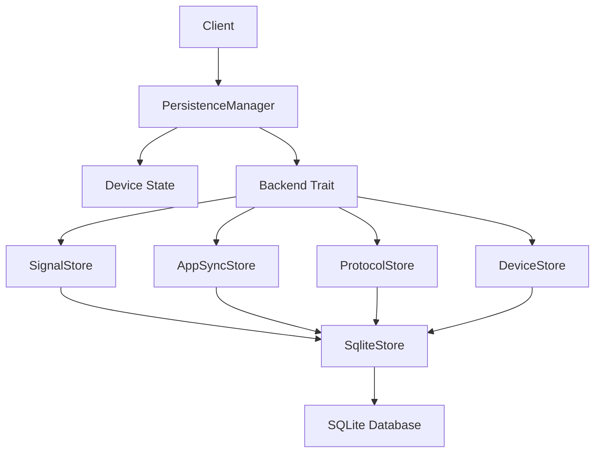
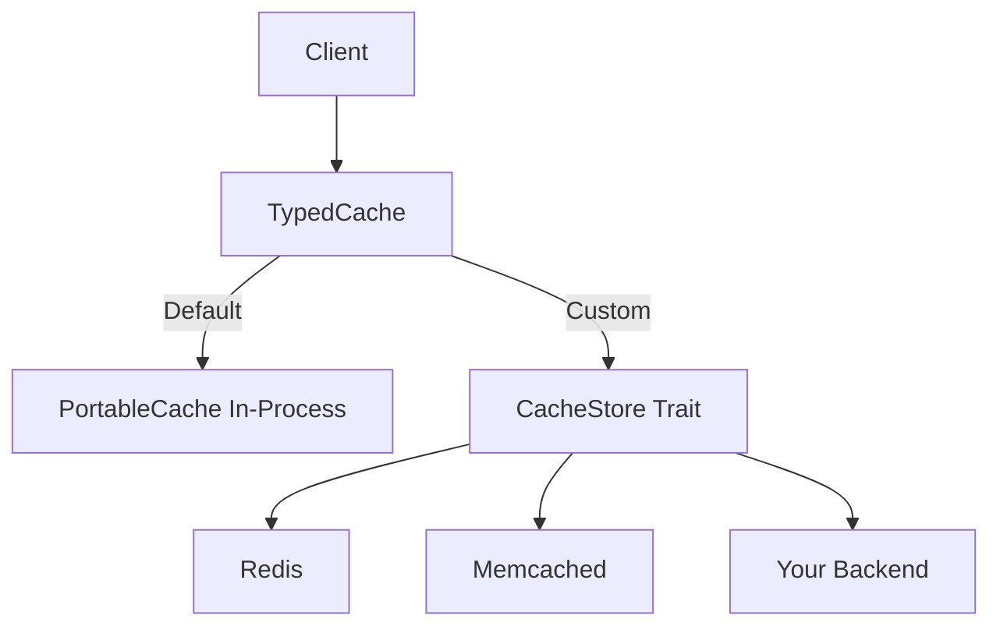

## Overview

WhatsApp-Rust uses a layered storage architecture with pluggable backends. The `PersistenceManager` manages all state changes, while the `Backend` trait defines storage operations for device data, Signal protocol keys, app state sync, and protocol-specific data.

## Architecture



## PersistenceManager

**Location:** `src/store/persistence_manager.rs`

### Purpose

Manages all device state changes and persistence operations. Acts as the gatekeeper for state modifications.

### Structure

```rust
pub struct PersistenceManager {
    device: Arc<tokio::sync::RwLock<Device>>,
    device_snapshot: std::sync::RwLock<Arc<Device>>,
    backend: Arc<dyn Backend>,
    dirty: Arc<AtomicBool>,
    save_notify: Arc<Event>,  // event_listener::Event (runtime-agnostic)
}
```

**Fields:**
- `device`: In-memory device state (protected by `tokio::sync::RwLock`; write-locked only during mutations)
- `device_snapshot`: Cached `Arc<Device>` rebuilt under the write guard on every mutation — read by `get_device_snapshot()` with no contention against writers
- `backend`: Storage backend implementation
- `dirty`: Flag indicating unsaved changes
- `save_notify`: Notification channel for background saver (uses `event_listener::Event` for runtime-agnostic operation)

### Initialization

```rust
impl PersistenceManager {
    pub async fn new(backend: Arc<dyn Backend>) -> Result<Self, StoreError> {
        // Ensure device row exists
        let exists = backend.exists().await?;
        if !exists {
            backend.create().await?;
        }

        // Load existing data or create new
        let device_data = backend.load().await?;
        let device = if let Some(data) = device_data {
            let mut dev = Device::new(backend.clone());
            dev.load_from_serializable(data);
            dev
        } else {
            Device::new(backend.clone())
        };

        let snapshot = Arc::new(device.clone());
        Ok(Self {
            device: Arc::new(tokio::sync::RwLock::new(device)),
            device_snapshot: std::sync::RwLock::new(snapshot),
            backend,
            dirty: Arc::new(AtomicBool::new(false)),
            save_notify: Arc::new(Event::new()),
        })
    }
}
```

### Key Methods

#### get_device_snapshot

**Purpose:** Read-only access to device state

```rust
pub fn get_device_snapshot(&self) -> Arc<Device> {
    self.device_snapshot.read().unwrap().clone()
}
```

**Usage:**
```rust
let snapshot = client.persistence_manager.get_device_snapshot();
println!("Device ID: {:?}", snapshot.pn);
println!("Push Name: {}", snapshot.push_name);
```

#### modify_device

**Purpose:** Modify device state with automatic dirty tracking

```rust
pub async fn modify_device<F, R>(&self, modifier: F) -> R
where
    F: FnOnce(&mut Device) -> R,
{
    let mut device_guard = self.device.write().await;
    let result = modifier(&mut device_guard);

    // Rebuild the cached snapshot before releasing the write lock
    *self.device_snapshot.write().unwrap() = Arc::new(device_guard.clone());

    self.dirty.store(true, Ordering::Relaxed);
    self.save_notify.notify(1);

    result
}
```

**Usage:**
```rust
client.persistence_manager.modify_device(|device| {
    device.push_name = "New Name".to_string();
}).await;
```

#### process_command

**Purpose:** Apply state changes via `DeviceCommand`

```rust
pub async fn process_command(&self, command: DeviceCommand) {
    self.modify_device(|device| {
        apply_command_to_device(device, command);
    }).await;
}
```

**Usage:**
```rust
client.persistence_manager
    .process_command(DeviceCommand::SetPushName("New Name".to_string()))
    .await;
```

### Background Saver

**Purpose:** Periodically persist dirty state to disk

```rust
pub fn run_background_saver(self: Arc<Self>, runtime: Arc<dyn Runtime>, interval: Duration) {
    runtime.spawn(Box::pin(async move {
        loop {
            let listener = self.save_notify.listen();
            // Race: wake on notification or after interval
            futures_lite::future::or(listener, async {
                // sleep using runtime abstraction
                runtime.sleep(interval).await;
            }).await;

            if let Err(e) = self.save_to_disk().await {
                error!("Error saving device state: {e}");
            }
        }
    }));
}

async fn save_to_disk(&self) -> Result<(), StoreError> {
    if self.dirty.swap(false, Ordering::AcqRel) {
        let device_guard = self.device.read().await;
        let serializable_device = device_guard.to_serializable();
        drop(device_guard);

        self.backend.save(&serializable_device).await?;
    }
    Ok(())
}
```

**Behavior:**
- Wakes up when notified or after interval
- Only saves if dirty flag is set
- Uses optimistic locking (dirty flag)

**Start background saver:**
```rust
let persistence_manager = Arc::new(PersistenceManager::new(backend).await?);
persistence_manager.clone().run_background_saver(runtime.clone(), Duration::from_secs(30));
```

## Backend Trait

**Location:** `wacore/src/store/traits.rs`

### Overview

The `Backend` trait is automatically implemented for any type that implements all four domain-specific traits:

```rust
pub trait Backend: SignalStore + AppSyncStore + ProtocolStore + DeviceStore + Send + Sync {}
```

### Domain Traits

## SignalStore

**Purpose:** Signal protocol cryptographic operations

```rust
use bytes::Bytes; // from the `bytes` crate
use std::sync::Arc;

#[async_trait]
pub trait SignalStore: Send + Sync {
    // Identity Operations
    async fn put_identity(&self, address: &str, key: [u8; 32]) -> Result<()>;
    async fn load_identity(&self, address: &str) -> Result<Option<[u8; 32]>>;
    async fn delete_identity(&self, address: &str) -> Result<()>;
    async fn delete_identities_batch(&self, addresses: &[Arc<str>]) -> Result<()>; // has default impl looping over delete_identity

    // Session Operations
    async fn get_session(&self, address: &str) -> Result<Option<Bytes>>;
    async fn put_session(&self, address: &str, session: &[u8]) -> Result<()>;
    async fn delete_session(&self, address: &str) -> Result<()>;
    async fn delete_sessions_batch(&self, addresses: &[Arc<str>]) -> Result<()>; // has default impl looping over delete_session
    async fn has_session(&self, address: &str) -> Result<bool>; // has default impl using get_session

    // PreKey Operations
    async fn store_prekey(&self, id: u32, record: &[u8], uploaded: bool) -> Result<()>;
    async fn store_prekeys_batch(&self, keys: &[(u32, Bytes)], uploaded: bool) -> Result<()>; // has default impl looping over store_prekey
    async fn load_prekey(&self, id: u32) -> Result<Option<Bytes>>;
    async fn load_prekeys_batch(&self, ids: &[u32]) -> Result<Vec<(u32, Bytes)>>; // has default impl looping over load_prekey

    async fn remove_prekey(&self, id: u32) -> Result<()>;
    async fn remove_prekeys_batch(&self, ids: &[u32]) -> Result<()>; // has default impl looping over remove_prekey
    /// Mark already-stored prekeys as uploaded. UPDATE semantics — a key
    /// consumed (deleted) between the upload snapshot and this call must stay
    /// deleted, never resurrected by an upsert.
    async fn mark_prekeys_uploaded(&self, ids: &[u32]) -> Result<()>;
    async fn get_max_prekey_id(&self) -> Result<u32>;

    // Signed PreKey Operations
    async fn store_signed_prekey(&self, id: u32, record: &[u8]) -> Result<()>;
    async fn load_signed_prekey(&self, id: u32) -> Result<Option<Vec<u8>>>;
    async fn load_all_signed_prekeys(&self) -> Result<Vec<(u32, Vec<u8>)>>;
    async fn remove_signed_prekey(&self, id: u32) -> Result<()>;

    // Sender Key Operations (for groups)
    async fn put_sender_key(&self, address: &str, record: &[u8]) -> Result<()>;
    async fn get_sender_key(&self, address: &str) -> Result<Option<Vec<u8>>>;
    async fn delete_sender_key(&self, address: &str) -> Result<()>;
    async fn delete_sender_keys_batch(&self, addresses: &[Arc<str>]) -> Result<()>; // has default impl looping over delete_sender_key
}
```

**Usage Example:**
```rust
// Store identity key for a contact
backend.put_identity(
    "15551234567@s.whatsapp.net:0",
    identity_key
).await?;

// Load session for decryption
if let Some(session) = backend.get_session("15551234567@s.whatsapp.net:0").await? {
    // Decrypt message using session
}
```

### SignalStoreCache

**Location:** `wacore/src/store/signal_cache.rs` (re-exported from `src/store/signal_cache.rs`)

The `SignalStoreCache` provides an in-memory cache layer for Signal protocol state, matching WhatsApp Web's `SignalStoreCache` implementation. All crypto operations read and write through this cache, with database writes deferred to explicit `flush()` calls.

Sessions and sender keys are cached as deserialized objects (`SessionRecord` and `SenderKeyRecord` respectively), matching WhatsApp Web's pattern where the JS object IS the cache. Serialization only happens during `flush()` — not on every `store_session` or `put_sender_key` call. Identity stores use `Arc<[u8]>` byte caches.

```rust
pub struct SignalStoreCache {
    sessions: Mutex<SessionStoreState>,
    identities: Mutex<ByteStoreState>,
    sender_keys: Mutex<SenderKeyStoreState>,
}

// Session object cache — no per-message serialize/deserialize
struct SessionStoreState {
    cache: HashMap<Arc<str>, Option<SessionRecord>>,  // None = known-absent
    dirty: HashSet<Arc<str>>,                          // Modified keys pending flush
    deleted: HashSet<Arc<str>>,                        // Deleted keys pending flush
}

// Sender key object cache (same pattern as sessions)
struct SenderKeyStoreState {
    cache: HashMap<Arc<str>, Option<SenderKeyRecord>>,  // None = known-absent
    dirty: HashSet<Arc<str>>,                            // Modified keys pending flush
}

// Byte cache for identities
struct ByteStoreState {
    cache: HashMap<Arc<str>, Option<Arc<[u8]>>>,  // None = known-absent
    dirty: HashSet<Arc<str>>,
    deleted: HashSet<Arc<str>>,
}
```

**Key features:**
- **Session object cache**: Sessions are stored as `SessionRecord` objects, eliminating protobuf encode/decode from the per-message path. Cold loads deserialize from backend bytes once and cache the object; subsequent reads return the cached object directly
- **Sender key object cache**: Sender keys are stored as `SenderKeyRecord` objects (same pattern as sessions), eliminating serialize/deserialize from the per-message group encryption path. Cold loads deserialize from backend bytes once and cache the object
- **`Arc` previous sessions**: `SessionRecord.previous_sessions` is wrapped in `Arc<Vec<SessionStructure>>`, making clone O(1) for the ~40 archived sessions. Only rare paths (archive, promote, take/restore) trigger `Arc::make_mut`
- **Owned `store_session`**: The `store_session` method takes `SessionRecord` by value, enabling zero-cost moves from the protocol layer. The compiler enforces no use-after-store
- **Deferred writes**: Changes are accumulated in memory and batch-written on `flush()`. Sessions and sender keys are serialized only during `flush()`, not on every store
- **Redundant write elimination**: For identities (which rarely change), `put_dedup()` compares incoming bytes against the cached value and skips if identical
- **Negative caching**: Known-absent keys are cached as `None` to avoid repeated DB lookups
- **Independent locking**: Sessions, identities, and sender keys each have their own mutex
- **O(1) key cloning**: Keys stored as `Arc<str>` so cloning a key is a refcount bump instead of a heap allocation. The `key_for()` method reuses existing `Arc<str>` keys from the HashMap via `get_key_value()`, avoiding heap allocation on the hot path
- **Single-allocation keys**: Session lock keys use `to_protocol_address_string()` (format: `user[:device]@server.0`) which builds the key string in one allocation. `ProtocolAddress` itself is allocation-free for addresses that fit inline (up to 47 bytes), but `to_string()` on top of it still allocates, so this remains the cheaper path when only the string is needed. See [Signal Protocol performance](/advanced/signal-protocol#single-allocation-session-lock-keys) for details

**Cache operations:**

```rust
// Read (loads from backend if not cached, returns SessionRecord object)
let session = cache.get_session(address, &backend).await?;

// Check existence (cache hit is O(1), cold load caches for subsequent get)
let exists = cache.has_session(address, &backend).await?;

// Write (takes ownership, marks as dirty, doesn't hit backend)
cache.put_session(address, record).await;

// Delete (marks for deletion on flush)
cache.delete_session(address).await;

// Persist all dirty state to backend (sessions serialized here)
cache.flush(&backend).await?;

// Clear cache (on disconnect/reconnect, retains allocated capacity)
cache.clear().await;
```

**Flush behavior:**
- Acquires all three mutexes to ensure consistency
- Sessions are serialized to bytes only during flush (not on every `put_session`)
- Only clears dirty tracking after ALL writes succeed
- On failure, dirty state is preserved for retry on next flush
- Deleted sessions, identities, pre-keys, and sender keys go through the batch methods (`delete_sessions_batch`, `delete_identities_batch`, `remove_prekeys_batch`, `delete_sender_keys_batch`) rather than one backend call per row

**Batched deletes:** Before [whatsapp-rust#1395](https://github.com/oxidezap/whatsapp-rust/pull/1395), every delete in `flush` was its own backend call — a `spawn_blocking`, a pool checkout, and a WAL commit each, roughly 60 µs on disk. That's the shape an offline drain or an identity reset produces: many sessions, identities, or consumed pre-keys dropped in one flush. `SqliteStore` now overrides the four batch methods above with a single transaction and chunked `IN` lists; a backend that doesn't override them keeps the old per-row loop as the default. A single deleted row costs the same either way — the warm steady state, which rarely deletes, is unaffected.

| bench (median), file-backed SQLite | per row | batched |
| --- | --- | --- |
| `delete_sessions` × 8 | 515 µs | 89 µs |
| `delete_sessions` × 64 | 4.40 ms | 221 µs |
| `remove_prekeys` × 8 | 502 µs | 85 µs |
| `remove_prekeys` × 64 | 4.14 ms | 154 µs |

**Undecodable session rows:** Deserialization is a pure function of the stored bytes. A session row that fails to decode once — from genuine corruption, or from a row written in a shape this build can no longer read, including a counter lease stranded by a since-fixed bug (see [DH ratchet resets rebase the lease](/advanced/signal-protocol#dh-ratchet-resets-rebase-the-lease)) — fails identically forever.

- `get_session`, `checkout_session`, and `has_session` all report that row as **absent** instead of propagating a decode error. Loading the row doesn't repair it by itself — it only lets the caller treat the address as session-less.
- That matters because the paths that would otherwise repair the session — decrypting the peer's next pre-key message, the retry-receipt handler — have to load the record first. If the decode error propagated instead, it would strand the address until you deleted the row by hand.
- Reporting the row absent lets the ordinary no-session recovery run instead: the next send or decrypt for that address fetches a fresh pre-key bundle and persists a replacement session, overwriting the unreadable row. This build never derives key material from bytes it can't decode, so it loses nothing usable — but the overwrite is destructive to the original bytes. If you're rolling back to a build that could still decode that row, back up the database first; the original bytes don't survive the overwrite.
- `has_session()` decodes the row instead of only checking for its existence, so it never reports a quarantined row as present to a caller deciding whether to skip recovery.
- Each quarantine increments the `wa_session_record_quarantined_total` [counter](/advanced/metrics#counters). Watch for a non-zero rate — steady state is zero.

## AppSyncStore

**Purpose:** WhatsApp app state synchronization

```rust
#[async_trait]
pub trait AppSyncStore: Send + Sync {
    // Sync Keys
    async fn get_sync_key(&self, key_id: &[u8]) -> Result<Option<AppStateSyncKey>>;
    async fn set_sync_key(&self, key_id: &[u8], key: AppStateSyncKey) -> Result<()>;

    // Version Tracking
    // `None` means the collection has never synced — distinct from a collection
    // that synced and is legitimately empty, which sits at version 0 with a record.
    async fn get_version(&self, name: &str) -> Result<Option<HashState>>;
    // Forgets a collection's version, returning it to the never-synced state
    // (used to force a rebuild from a fresh snapshot).
    async fn delete_version(&self, name: &str) -> Result<()>;
    async fn set_version(&self, name: &str, state: HashState) -> Result<()>;

    // Mutation MACs
    async fn put_mutation_macs(
        &self,
        name: &str,
        version: u64,
        mutations: &[AppStateMutationMAC],
    ) -> Result<()>;
    async fn get_mutation_mac(&self, name: &str, index_mac: &[u8]) -> Result<Option<Vec<u8>>>;
    // Batched previous-MAC lookup (v0.6); default loops over get_mutation_mac.
    // index_macs are inline [u8; 32] (an index MAC is always a full
    // HMAC-SHA256 output) — no per-MAC heap allocation on either side.
    async fn get_mutation_macs(
        &self,
        name: &str,
        index_macs: &[[u8; 32]],
    ) -> Result<HashMap<[u8; 32], Vec<u8>>>;
    async fn delete_mutation_macs(&self, name: &str, index_macs: &[Vec<u8>]) -> Result<()>;
    async fn get_latest_sync_key_id(&self) -> Result<Option<Vec<u8>>>;
}
```

**AppStateSyncKey Structure:**
```rust
#[derive(Debug, Clone, Default, Serialize, Deserialize)]
pub struct AppStateSyncKey {
    pub key_data: Vec<u8>,
    pub fingerprint: Vec<u8>,
    pub timestamp: i64,
}
```

**`HashState` structure:**
```rust
pub struct HashState {
    pub version: u64,
    pub hash: [u8; 128],
    pub index_value_map: HashMap<String, Vec<u8>>,
    pub mac_mismatch_fatal: bool,
    // Set only when a sync run reaches its terminal page — a bootstrap
    // deferred mid-run leaves this false even though version already moved.
    // `#[serde(default)]`, so rows written before this field existed decode
    // it as `false`. That only forces a re-bootstrap for a legacy row still
    // sitting at version 0 — the ambiguous case this field exists to settle.
    // A legacy row with a real version already has `has_baseline()` true and
    // asks for patches as before.
    pub bootstrapped: bool,
}
```

Call `state.has_baseline()` to decide whether an incoming sync should ask the server for a snapshot or for patches. It checks for a real ltHash to sync against (`bootstrapped || version > 0`), which is a weaker condition than `bootstrapped` alone: a partial bootstrap that already advanced `version` has a baseline but did not complete. That's why building an *outgoing* patch checks `bootstrapped` directly instead — it needs to know the bootstrap actually finished, not just that one started.

**Collections:**
- `critical_block` - Blocked contacts, push names
- `regular_high` - Mute settings, starred messages, contact info
- `regular_low` - Archive settings, pin settings
- `regular` - Other chat settings

## ProtocolStore

**Purpose:** WhatsApp Web protocol-specific storage

```rust
#[async_trait]
pub trait ProtocolStore: Send + Sync {
    // Per-Device Sender Key Tracking (matches WA Web's participant.senderKey Map)
    // Updated only AFTER the server ACKs the message stanza,
    // preventing stale entries from network failures mid-send.
    async fn get_sender_key_devices(&self, group_jid: &str) -> Result<Vec<(String, bool)>>;
    async fn set_sender_key_status(&self, group_jid: &str, entries: &[(&str, bool)]) -> Result<()>;
    async fn clear_sender_key_devices(&self, group_jid: &str) -> Result<()>;

    // Clear all sender key device tracking across ALL groups.
    // Provided for completeness; not invoked on identity change — WhatsApp Web's
    // `WAWebUpdateLocalSignalSession` only calls `markForgetSenderKey` per-group/per-device
    // on retry receipts, so a global wipe here would empty the tracker too aggressively.
    async fn clear_all_sender_key_devices(&self) -> Result<()>;

    // LID-PN Mapping (Long-term ID to Phone Number)
    async fn get_lid_mapping(&self, lid: &str) -> Result<Option<LidPnMappingEntry>>;
    async fn get_pn_mapping(&self, phone: &str) -> Result<Option<LidPnMappingEntry>>;
    async fn put_lid_mapping(&self, entry: &LidPnMappingEntry) -> Result<()>;
    async fn get_all_lid_mappings(&self) -> Result<Vec<LidPnMappingEntry>>;

    // Base Key Collision Detection
    async fn save_base_key(&self, address: &str, message_id: &str, base_key: &[u8]) -> Result<()>;
    async fn has_same_base_key(&self, address: &str, message_id: &str, current_base_key: &[u8]) -> Result<bool>;
    async fn delete_base_key(&self, address: &str, message_id: &str) -> Result<()>;

    // Device Registry
    async fn update_device_list(&self, record: DeviceListRecord) -> Result<()>;
    async fn get_devices(&self, user: &str) -> Result<Option<DeviceListRecord>>;

    // Delete a device list record, forcing a network re-fetch on next query.
    async fn delete_devices(&self, user: &str) -> Result<()>;

    // TcToken Storage (Trusted Contact Tokens)
    async fn get_tc_token(&self, jid: &str) -> Result<Option<TcTokenEntry>>;
    async fn put_tc_token(&self, jid: &str, entry: &TcTokenEntry) -> Result<()>;
    async fn delete_tc_token(&self, jid: &str) -> Result<()>;
    async fn get_all_tc_token_jids(&self) -> Result<Vec<String>>;
    // Pruned only when BOTH the received-token cutoff and the sender-bucket
    // cutoff have passed, so recent sender-side state outlives an expired token.
    async fn delete_expired_tc_tokens(&self, token_cutoff: i64, sender_cutoff: i64) -> Result<u32>;
    // Advance-only upsert of the sender-side issuance timestamp; inserts a
    // byte-less placeholder if no entry exists yet. Defaulted (read-modify-write).
    async fn touch_tc_token_sender_timestamp(&self, jid: &str, sender_timestamp: i64) -> Result<()> { /* default */ }
    // Store a token received from a contact without clobbering an existing
    // sender_timestamp. Newer-wins: a stale write (older token_timestamp,
    // unless the existing token is a byte-less placeholder) is a no-op.
    // Defaulted (read-modify-write); SqliteStore/InMemoryBackend enforce it atomically.
    async fn store_received_tc_token(&self, jid: &str, token: &[u8], token_timestamp: i64) -> Result<()> { /* default */ }

    // Sent Message Store (retry support, matches WA Web's getMessageTable)
    async fn store_sent_message(&self, chat_jid: &str, message_id: &str, payload: &[u8]) -> Result<()>;
    async fn take_sent_message(&self, chat_jid: &str, message_id: &str) -> Result<Option<Vec<u8>>>;
    async fn delete_expired_sent_messages(&self, cutoff_timestamp: i64) -> Result<u32>;
}
```

**LidPnMappingEntry:**
```rust
#[derive(Debug, Clone, Serialize, Deserialize)]
pub struct LidPnMappingEntry {
    pub lid: String,
    pub phone_number: String,
    pub created_at: i64,
    pub updated_at: i64,
    pub learning_source: String,
}
```

### LidPnCache

**Location:** `src/lid_pn_cache.rs`

The `LidPnCache` provides an in-memory cache for LID to phone number mappings, used for Signal address resolution. WhatsApp Web uses LID-based addresses for Signal sessions when available.

```rust
pub struct LidPnCache {
    lid_to_entry: TypedCache<Arc<str>, Arc<LidPnEntry>>,
    pn_to_entry: TypedCache<Arc<str>, Arc<LidPnEntry>>,
}
```

**Defaults match `WAWebLidPnCache`:**
- **Time-based expiry**: none — entries do not idle out
- **Capacity**: effectively unbounded (`u64::MAX`; no dedicated `unbounded()` builder)

A custom `CacheEntryConfig` can impose a capacity bound if memory pressure requires it. Be aware that capacity-LRU eviction silently downgrades Signal addresses from `@lid` (or `@hosted.lid`) back to `@c.us`, which can cause `SessionNotFound` decryption failures. Notably, this keeps `status@broadcast` participants resolving to `@lid` for the entire session, matching WA Web behavior.

**Bidirectional lookups:**

```rust
// Get LID for a phone number
let lid = cache.get_current_lid("15551234567").await;

// Get phone number for a LID
let phone = cache.get_phone_number("100000012345678").await;
```

<Note>
Since v0.6 `get_current_lid` (and the `SendContextResolver::get_lid_for_phone` trait method) returns `Option<wacore_binary::CompactString>` instead of `Option<String>`. This avoids a heap allocation on the hot group-send path, since LID identifiers fit inline in a `CompactString`. Call `.as_deref()` for `&str` comparisons, and update any custom `SendContextResolver` implementation to the new return type.
</Note>

**Timestamp conflict resolution:**

When multiple LIDs exist for the same phone number, the entry with the most recent `created_at` timestamp wins for the PN → LID lookup:

```rust
// Add mapping (only updates PN map if newer timestamp)
cache.add(entry).await;
```

**Initialization:**

```rust
// Warm up cache from persistent storage on client init
let entries = backend.get_all_lid_mappings().await?;
cache.warm_up(entries).await;
```

**Session migration on LID discovery:**

When a new LID-PN mapping is added to the cache, the client automatically migrates any Signal sessions stored under the PN address to the corresponding LID address. The migration reads and writes through the `SignalStoreCache` (not the backend directly) to avoid stale reads when the cache has unflushed mutations, then flushes the migrated state to the backend. This prevents `SessionNotFound` decryption failures when the phone switches from PN to LID addressing. See [Signal Protocol — PN→LID session migration](/advanced/signal-protocol#pnlid-session-migration) for details.

**Learning sources:**
- `usync` - User sync responses
- `peer_pn_message` / `peer_lid_message` - Peer messages
- `pairing` - Device pairing
- `device_notification` - Device notifications
- `blocklist_active` / `blocklist_inactive` - Blocklist operations

**DeviceListRecord:**
```rust
#[derive(Debug, Clone, Serialize, Deserialize)]
pub struct DeviceListRecord {
    pub user: String,
    pub devices: Vec<DeviceInfo>,
    pub timestamp: i64,
    pub phash: Option<String>,
    /// ADV raw_id from ADVKeyIndexList — used to detect identity changes.
    /// When this changes, all sessions and sender keys for the user must be cleared.
    pub raw_id: Option<u32>,
}

#[derive(Debug, Clone, Serialize, Deserialize)]
pub struct DeviceInfo {
    pub device_id: u32,
    pub key_index: Option<u32>,
    /// Whether the device belongs to WhatsApp's hosted PN/LID address space.
    #[serde(default)]
    pub is_hosted: bool,
}
```

`DeviceInfo` gained the `is_hosted` field, populated from usync device-list results. Use `DeviceInfo::new(device_id, key_index).with_hosting(is_hosted)` instead of a struct literal, and add a `..` to any exhaustive destructuring pattern. Persisted JSON without `is_hosted` still deserializes correctly (`is_hosted` defaults to `false`). See [Store: DeviceInfo](/api/store#devicelistrecord) and [USync — Hosted addressing](/api/usync#hosted-addressing) for details.

**TcTokenEntry:**
```rust
#[derive(Debug, Clone, Serialize, Deserialize)]
pub struct TcTokenEntry {
    pub token: Vec<u8>,
    pub token_timestamp: i64,
    pub sender_timestamp: Option<i64>,
}
```

## DeviceStore

**Purpose:** Device data persistence

```rust
#[async_trait]
pub trait DeviceStore: Send + Sync {
    async fn save(&self, device: &Device) -> Result<()>;
    async fn load(&self) -> Result<Option<Device>>;
    async fn exists(&self) -> Result<bool>;
    async fn create(&self) -> Result<i32>;
    async fn snapshot_db(&self, _name: &str, _extra_content: Option<&[u8]>) -> Result<()>;
}
```

**Device Structure:**
```rust
// wacore/src/store/device.rs
#[derive(Clone, Serialize, Deserialize)]
pub struct Device {
    pub pn: Option<Jid>,                    // Phone number JID
    pub lid: Option<Jid>,                   // Long-term identifier
    pub push_name: String,                  // Display name
    pub registration_id: u32,               // Signal registration ID
    pub adv_secret_key: [u8; 32],          // Advertisement secret
    #[serde(with = "key_pair_serde")]
    pub identity_key: KeyPair,              // Signal identity keypair
    #[serde(with = "key_pair_serde")]
    pub noise_key: KeyPair,                 // Noise protocol keypair
    #[serde(with = "key_pair_serde")]
    pub signed_pre_key: KeyPair,            // Signal signed pre-key
    pub signed_pre_key_id: u32,
    #[serde(with = "BigArray")]
    pub signed_pre_key_signature: [u8; 64],
    #[serde(with = "account_serde", default)]
    pub account: Option<Arc<wa::ADVSignedDeviceIdentity>>,
    pub app_version_primary: u32,
    pub app_version_secondary: u32,
    pub app_version_tertiary: u32,
    pub app_version_last_fetched_ms: i64,
    #[serde(skip)]
    pub device_props: wa::DeviceProps,       // Not persisted
    #[serde(skip)]
    pub client_profile: ClientProfile,       // Noise-handshake identity, not persisted
    #[serde(default)]
    pub edge_routing_info: Option<Vec<u8>>,  // Optimized reconnection
    #[serde(default)]
    pub props_hash: Option<String>,          // A/B experiment tracking
    #[serde(default)]
    pub next_pre_key_id: u32,               // Monotonic counter; advances at generation time (WA Web NEXT_PK_ID)
    #[serde(default)]
    pub first_unupload_pre_key_id: u32,     // First generated-but-unuploaded key (WA Web FIRST_UNUPLOAD_PK_ID); 0 = unset/legacy
    #[serde(default)]
    pub server_has_prekeys: bool,            // Whether server has prekeys uploaded
    #[serde(default)]
    pub nct_salt: Option<Vec<u8>>,           // NCT salt for cstoken computation
    #[serde(skip)]
    pub nct_salt_sync_seen: bool,            // Runtime flag: authoritative sync seen
    #[serde(default)]
    pub server_cert_chain: Option<CachedServerCertChain>, // Cached for Noise IK resume
    #[serde(default)]
    pub login_counter: i32,                  // Per-connect counter sent as ClientPayload.lc
    #[serde(default)]
    pub lid_migrated: bool,                  // Account is 1:1-LID-migrated; gates DM wire addressing
    #[serde(default)]
    pub last_signed_pre_key_rotation_ms: i64, // WA Web RotateKeyJob cadence clock; 0 = pre-feature device, baselined (not rotated) on first connect
    #[serde(default)]
    pub server_client_expiration: Option<ServerClientExpiration>, // Server's <ib><client_expiration> deadline for the running build; None until the server says otherwise
}

/// Cached form of the server's two-cert chain. `leaf.key` is the server
/// static public key consumed by Noise IK; the intermediate is kept solely
/// to mirror WA Web's expiry checks.
#[derive(Clone, Debug, PartialEq, Eq, Serialize, Deserialize)]
pub struct CachedServerCertChain {
    pub intermediate: CachedNoiseCert,
    pub leaf: CachedNoiseCert,
}

#[derive(Clone, Debug, PartialEq, Eq, Serialize, Deserialize)]
pub struct CachedNoiseCert {
    pub key: [u8; 32],     // 32-byte X25519 public key
    pub not_before: i64,   // Validity window (Unix epoch seconds)
    pub not_after: i64,
}

/// The server's answer to "when does this client build stop being accepted",
/// scoped to the build it was issued against.
#[derive(Clone, Debug, PartialEq, Eq, Serialize, Deserialize)]
pub struct ServerClientExpiration {
    pub expires_at: i64,           // Unix seconds; server stops accepting this build after this
    pub version: (u32, u32, u32),  // The (primary, secondary, tertiary) build the deadline applies to
}
```

The `server_cert_chain` field is populated after a successful XX (or XXfallback) handshake and consumed on the next connect to attempt **Noise IK**. It is cleared via `DeviceCommand::ClearServerCertChain` if a resumed IK handshake fails crypto-fatally. See [Authentication — Noise Protocol Handshake](/concepts/authentication#noise-protocol-handshake).

### ServerClientExpiration

`server_client_expiration` records the server's `<ib><client_expiration>` deadline (see [`ClientExpirationChanged`](/concepts/events#clientexpirationchanged)) — the date it expects to stop accepting the client build currently running. It is `None` until the server says otherwise, which is the common case: the stanza is sent when a build is being retired, not on every connect.

Set through `DeviceCommand::SetServerClientExpiration(Option<ServerClientExpiration>)`, applied by `ServerClientExpiration::decide` (`wacore/src/store/device.rs`) rather than written directly from the stanza's `t`:

- **The raw `t` only gets acted on when it is sooner than the stored deadline.** A `t` at or after the `expires_at` already held is treated as a stale retransmit or a host that hasn't caught up: it's ignored outright, and nothing is persisted or dispatched. This is a gate on the *raw* value, not a guarantee that the *stored* `expires_at` itself never moves later — see below.
- **At least three days of notice.** Whatever the server says, the recorded `expires_at` is floored at `now + 3 days`, evaluated at the moment the stanza is accepted — so a server that says "now" still leaves a window in which the build can be replaced.
- **Scoped to the running build.** A record left over from an earlier build (`version` doesn't match the running `(app_version_primary, app_version_secondary, app_version_tertiary)`) is treated as absent rather than compared against — otherwise an old build's nearer date could suppress the new build's own, unrelated deadline.
- A stanza with no `t` attribute withdraws the deadline (`DeviceCommand::SetServerClientExpiration(None)`), but only if one for the running build was actually held — withdrawing something never held is a no-op and dispatches no event.

The three-day floor is reapplied against "now" every time a `t` clears the gate above, and that interacts with the gate in a way worth knowing: an already-elapsed `t` (e.g. the server keeps resending `t=<some past second>`) stays "sooner than stored" indefinitely, so each resend clears the gate again and re-floors from the new "now" — pushing the *stored* `expires_at` later each time, even though the raw `t` never changed. A server that keeps signalling immediate expiry therefore holds a rolling three-day minimum-notice window rather than pinning one date. A dated `t` in the future, by contrast, settles once stored: restating it no longer clears the gate (it's equal to, not sooner than, `expires_at`), so further repeats change nothing and dispatch nothing.

Persisted as a single nullable `TEXT` column holding the record as JSON (see [Database schema](#database-schema) below) — a column per field buys nothing here, since nothing queries or orders by the version triple. A row that fails to decode (written by a newer build, or corrupted) reads as no deadline rather than failing the whole device load; the next `<ib>` restates it.

<Note>
  The `account` field uses a custom `account_serde` module to bridge buffa-generated protobuf types (which lack `serde::Deserialize`) into serde. It encodes `ADVSignedDeviceIdentity` to protobuf bytes on serialization and decodes them back on deserialization. The `#[serde(default)]` attribute ensures backward compatibility — old data missing this field deserializes as `None`.
</Note>

## SqliteStore implementation

**Location:** `storages/sqlite-storage/src/lib.rs`

<Note>
  As of v0.5, the `whatsapp-rust-sqlite-storage` crate bundles SQLite by default via the `bundled-sqlite` feature. You no longer need SQLite installed as a system dependency. To link against a system SQLite — or to avoid duplicate `sqlite3_*` symbols when your binary already links `libsql-ffi`, `sqlcipher`, or a custom SQLite build — enable the `sqlite-storage` feature on `whatsapp-rust` without `sqlite-storage-bundled`. See [Unbundling SQLite](/installation#unbundling-sqlite).
</Note>

### BLOB encoding

Three BLOB columns use **protobuf (via `buffa`)** for on-disk encoding:

| Table | Column | Domain type |
|-------|--------|-------------|
| `device` | `server_cert_chain` | `CachedServerCertChain` |
| `app_state_keys` | `key_data` | `AppStateSyncKey` |
| `app_state_versions` | `state_data` | `HashState` |

Protobuf's field-tagged wire format tolerates additive changes (adding or reordering fields) without corrupting persisted rows. The encode/decode helpers live in `storages/sqlite-storage/src/wire.rs`; `wacore` domain types are untouched — conversion happens only at the storage boundary.

#### Upgrading from a bincode-encoded database

No manual migration is needed. The storage layer self-heals lazily on first startup after upgrade:

- A BLOB that cannot be decoded as protobuf (a legacy bincode row or genuine corruption) is treated as **absent** rather than an error.
- App-state sync keys: the client discovers the account's other devices and requests the missing key from all of them concurrently, falling back to the primary alone if device discovery fails or returns none, bounded by the same 10-second recovery budget as an active waiter. Whichever device replies first triggers the next `set_sync_key` call, which overwrites the row in protobuf format.
- App-state versions: `get_version` reads the undecodable row as `None` — never synced — rather than a persisted version 0, so the collection bootstraps from a fresh snapshot instead of requesting patches on top of an empty ltHash. The first `set_version` call overwrites the row in protobuf format.
- Server cert chain: rebuilt on the next Noise XX handshake. The following `save_device_data` call overwrites the row in protobuf format.

Net effect: settings re-sync automatically on the first connection after upgrade, with no data loss and no manual DB intervention required.

### Database schema

The device table uses named columns for each field, making the schema self-documenting and reducing the risk of column mix-ups when fields are added:

```sql
-- Device table (named columns, not a serialized blob)
CREATE TABLE device (
    id INTEGER PRIMARY KEY AUTOINCREMENT,
    lid TEXT NOT NULL,
    pn TEXT NOT NULL,
    registration_id INTEGER NOT NULL,
    noise_key BLOB NOT NULL,
    identity_key BLOB NOT NULL,
    signed_pre_key BLOB NOT NULL,
    signed_pre_key_id INTEGER NOT NULL,
    signed_pre_key_signature BLOB NOT NULL,
    adv_secret_key BLOB NOT NULL,
    account BLOB,
    push_name TEXT NOT NULL DEFAULT '',
    app_version_primary INTEGER NOT NULL DEFAULT 0,
    app_version_secondary INTEGER NOT NULL DEFAULT 0,
    app_version_tertiary BIGINT NOT NULL DEFAULT 0,
    app_version_last_fetched_ms BIGINT NOT NULL DEFAULT 0,
    edge_routing_info BLOB,
    props_hash TEXT,
    next_pre_key_id INTEGER NOT NULL DEFAULT 0,
    first_unupload_pre_key_id INTEGER NOT NULL DEFAULT 0,  -- WA Web FIRST_UNUPLOAD_PK_ID; 0 = unset/legacy
    server_has_prekeys BOOLEAN NOT NULL DEFAULT 0,
    nct_salt BLOB,
    server_cert_chain BLOB,  -- Cached two-cert chain for Noise IK resume
    login_counter INTEGER NOT NULL DEFAULT 0,  -- Per-connect counter; sent as ClientPayload.lc
    lid_migrated BOOLEAN NOT NULL DEFAULT 0,  -- Account is 1:1-LID-migrated; gates DM wire addressing
    last_signed_pre_key_rotation_ms BIGINT NOT NULL DEFAULT 0,  -- WA Web RotateKeyJob cadence clock; 0 = unset/legacy, baselined on first connect
    server_client_expiration TEXT  -- ServerClientExpiration record as JSON; NULL = no deadline held
);

-- Signal protocol tables
CREATE TABLE identities (
    address TEXT NOT NULL,
    key BLOB NOT NULL,
    device_id INTEGER NOT NULL DEFAULT 1,
    PRIMARY KEY (address, device_id)
);

CREATE TABLE sessions (
    address TEXT NOT NULL,
    record BLOB NOT NULL,
    device_id INTEGER NOT NULL DEFAULT 1,
    PRIMARY KEY (address, device_id)
);

CREATE TABLE prekeys (
    id INTEGER NOT NULL,
    key BLOB NOT NULL,
    uploaded BOOLEAN NOT NULL DEFAULT FALSE,
    device_id INTEGER NOT NULL DEFAULT 1,
    PRIMARY KEY (id, device_id)
);

CREATE TABLE signed_prekeys (
    id INTEGER NOT NULL,
    record BLOB NOT NULL,
    device_id INTEGER NOT NULL DEFAULT 1,
    PRIMARY KEY (id, device_id)
);

CREATE TABLE sender_keys (
    address TEXT NOT NULL,
    record BLOB NOT NULL,
    device_id INTEGER NOT NULL DEFAULT 1,
    PRIMARY KEY (address, device_id)
);

-- App state sync tables
CREATE TABLE app_state_keys (
    key_id BLOB NOT NULL,
    key_data BLOB NOT NULL,
    device_id INTEGER NOT NULL DEFAULT 1,
    PRIMARY KEY (key_id, device_id)
);

CREATE TABLE app_state_versions (
    name TEXT NOT NULL,
    state_data BLOB NOT NULL,
    device_id INTEGER NOT NULL DEFAULT 1,
    PRIMARY KEY (name, device_id)
);

CREATE TABLE app_state_mutation_macs (
    name TEXT NOT NULL,
    version BIGINT NOT NULL,
    index_mac BLOB NOT NULL,
    value_mac BLOB NOT NULL,
    device_id INTEGER NOT NULL DEFAULT 1,
    PRIMARY KEY (name, index_mac, device_id)
);

-- Protocol tables
-- Unified per-device sender key tracking (matches WA Web's participant.senderKey Map)
CREATE TABLE sender_key_devices (
    group_jid TEXT NOT NULL,
    device_jid TEXT NOT NULL,
    has_key INTEGER NOT NULL DEFAULT 0,
    device_id INTEGER NOT NULL DEFAULT 1,
    updated_at INTEGER NOT NULL DEFAULT (strftime('%s', 'now')),
    PRIMARY KEY (group_jid, device_jid, device_id)
);
CREATE INDEX idx_sender_key_devices_device_jid ON sender_key_devices (device_id, device_jid);

CREATE TABLE lid_pn_mapping (
    lid TEXT NOT NULL,
    phone_number TEXT NOT NULL,
    created_at BIGINT NOT NULL,
    learning_source TEXT NOT NULL,
    updated_at BIGINT NOT NULL,
    device_id INTEGER NOT NULL DEFAULT 1,
    PRIMARY KEY (lid, device_id)
);

CREATE TABLE base_keys (
    address TEXT NOT NULL,
    message_id TEXT NOT NULL,
    base_key BLOB NOT NULL,
    device_id INTEGER NOT NULL DEFAULT 1,
    created_at INTEGER NOT NULL DEFAULT (strftime('%s', 'now')),
    PRIMARY KEY (address, message_id, device_id)
);
CREATE INDEX idx_base_keys_created ON base_keys (device_id, created_at);

CREATE TABLE device_registry (
    user_id TEXT NOT NULL,
    devices_json TEXT NOT NULL,
    timestamp INTEGER NOT NULL,
    phash TEXT,
    device_id INTEGER NOT NULL DEFAULT 1,
    updated_at INTEGER NOT NULL DEFAULT (strftime('%s', 'now')),
    PRIMARY KEY (user_id, device_id)
);

CREATE TABLE tc_tokens (
    jid TEXT NOT NULL,
    token BLOB NOT NULL,
    token_timestamp INTEGER NOT NULL,
    sender_timestamp INTEGER,
    device_id INTEGER NOT NULL DEFAULT 1,
    updated_at INTEGER NOT NULL DEFAULT (strftime('%s', 'now')),
    PRIMARY KEY (jid, device_id)
);

-- Sent message store for retry handling
CREATE TABLE sent_messages (
    chat_jid TEXT NOT NULL,
    message_id TEXT NOT NULL,
    payload BLOB NOT NULL,
    device_id INTEGER NOT NULL DEFAULT 1,
    created_at INTEGER NOT NULL DEFAULT (strftime('%s', 'now')),
    PRIMARY KEY (chat_jid, message_id, device_id)
);

CREATE INDEX idx_sent_messages_created ON sent_messages (created_at, device_id);
```

`identities`, `sessions`, `prekeys`, and `sender_keys` have no standalone index on `device_id` alone. A prior migration added one to each table when multi-account support landed, but every hot query already filters on the full primary key (`address`/`id` plus `device_id`), so that index only ever added a third b-tree write per inserted or deleted row without serving any selective read — `device_id` alone has one distinct value per account. [whatsapp-rust#1395](https://github.com/oxidezap/whatsapp-rust/pull/1395) drops all four (`idx_identities_device_id`, `idx_sessions_device_id`, `idx_prekeys_device_id`, `idx_sender_keys_device_id`); the only `device_id`-alone reads are account teardown, where a table scan is fine.

[whatsapp-rust#1411](https://github.com/oxidezap/whatsapp-rust/pull/1411) applies the same reasoning to the last five standalone `device_id` indexes (`idx_signed_prekeys_device_id`, `idx_app_state_keys_device_id`, `idx_app_state_versions_device_id`, `idx_app_state_mutation_macs_device_id`, `idx_base_keys_device`) and drops them too — each table is `PRIMARY KEY (..., device_id)` and every query already filters on that key. In their place, two indexes that back real queries: `idx_base_keys_created` (`device_id, created_at`), read by the new [`delete_expired_base_keys`](/api/store#base-key-collision-detection) sweep, and `idx_sender_key_devices_device_jid` (`device_id, device_jid`), which turned a full-table-scan delete on every peer device-removal notification (measured linear in row count — 770 µs at 10k rows, 5.39 ms at 70k) into a sub-25 µs index lookup regardless of table size.

### Multi-Account Support

**Each device has unique `device_id`:**

```rust
use whatsapp_rust::store::SqliteStore;

// Account 1
let backend1 = Arc::new(SqliteStore::new_for_device("whatsapp.db", 1).await?);
let pm1 = PersistenceManager::new(backend1).await?;

// Account 2
let backend2 = Arc::new(SqliteStore::new_for_device("whatsapp.db", 2).await?);
let pm2 = PersistenceManager::new(backend2).await?;
```

**All tables scoped by `device_id`:**
```sql
SELECT * FROM sessions WHERE device_id = 1 AND address = ?;
```

#### Account lifecycle API

`new_for_device` opens an account whose id you already know. When your app needs to enumerate the accounts in a file, allocate a new one without racing on the id, or tear one down, use the account lifecycle API on `SqliteStore` instead:

```rust
use whatsapp_rust::store::SqliteStore;

let store = SqliteStore::new("whatsapp.db").await?;

// Enumerate accounts already in the file.
for account in store.list_devices().await? {
    let session = store.share_for_device(account.id);
    // hand `session` to your per-account client
}

// Allocate a fresh, unpaired account. The id comes from SQLite so two
// concurrent callers never collide, and a removed id is never reissued.
let (new_id, new_account) = store.create_sibling_device().await?;

// Wipe an account and start it over under the same id.
let reset = store.reset_device(new_id).await?;

// Delete an account for good; the id is retired.
store.remove_device(new_id).await?;
```

`list_devices` returns [`StoredDeviceSummary`](/api/store#storeddevicesummary) rows: `id`, `pn`, `lid`, `push_name`, and a `linked` flag that is `true` only once the account is paired. `reset_device` and `remove_device` run one `BEGIN IMMEDIATE` transaction that purges every account-scoped table before recreating or deleting the `device` row, so a reader never sees a half-cleared account and a later `create_sibling_device` never inherits stale sessions from a removed one. A missing account returns [`StoreError::DeviceNotFound`](/api/store#error-handling-1). See [Account lifecycle](/api/store#account-lifecycle) for the full API and the caller-side rule about stopping background work before resetting or removing an account.

### Memory and Thread Tuning (`SqliteStoreConfig`)

Each session owns its own `SqliteStore`, so the store's fixed costs (thread-pool threads, pooled connections, page cache) multiply with session count. On a host running many sessions the defaults from `SqliteStore::new` / `new_for_device` are deliberately low-memory; `SqliteStoreConfig` lets you override them when you need more throughput on a single session.

**Default (low-memory) profile:**

| Setting | Default | Notes |
|---------|---------|-------|
| `pool_size` | `1` | Connections available to the write path (`run`); the store serializes them via its internal semaphore. Not the store's total concurrency once `read_pool_size` is nonzero — see below |
| `read_pool_size` | `1` | Extra connections reserved for reads only, on top of `pool_size`; set to `0` to queue reads on the write path's permit instead (the default before [whatsapp-rust#1401](https://github.com/oxidezap/whatsapp-rust/pull/1401)). Only takes effect on a WAL connection — on a non-WAL connection your reads always queue on `pool_size` regardless of this setting |
| `cache_size_kib` | `512` | Per-connection page cache (~512 KiB) |
| `busy_timeout` | `30 s` | SQLite busy-timeout |
| `synchronous` | `NORMAL` | WAL-safe durability |
| `thread_pool` | shared process-wide pool | One lazy pool across all stores; ~0 idle threads per store |

**`SqliteStoreConfig` struct:**

```rust
pub struct SqliteStoreConfig {
    /// Max concurrent operations on the write path (`run`): r2d2 `max_size`
    /// AND the internal semaphore permits, kept in lockstep. Clamped to at
    /// least 1. This bounds `run`, not the store as a whole — connections
    /// from `read_pool_size` sit on top of it and aren't counted here.
    ///
    /// Raising this makes *writes* concurrent, which SQLite does not want: two
    /// deferred transactions that both read and then write deadlock on the
    /// upgrade, and `busy_timeout` cannot break it. Leave it at 1 and reach for
    /// `read_pool_size` instead — that is the knob for concurrency, and it is
    /// safe because WAL readers never contend for the write lock.
    pub pool_size: u32,
    /// Extra connections reserved for read-only work, each free to run while a
    /// write holds the write permit. Defaults to `1`. Without a dedicated
    /// reader, your reads queue behind whatever the write permit is doing —
    /// we measured p50 7.2 ms / p99 22.8 ms during a write-behind flush at
    /// `0`, against 0.17 ms / 4.0 ms with one reader. Set it to `0` to put
    /// every operation back on the single queue, exactly as before this knob
    /// existed. This only helps on a WAL connection; on a non-WAL connection
    /// your reads queue on `pool_size` regardless of this setting.
    ///
    /// Each reader costs one connection's page cache (`cache_size_kib`), so
    /// set this to `0` if you're holding many per-session stores that read
    /// rarely.
    pub read_pool_size: u32,
    /// Per-connection SQLite page cache in KiB.
    pub cache_size_kib: u32,
    /// SQLite busy-timeout.
    pub busy_timeout: Duration,
    /// SQLite PRAGMA synchronous level.
    pub synchronous: Synchronous,
    /// Optional shared r2d2 thread pool. When `None`, the store uses the
    /// process-wide lazy pool. Inject a custom pool (e.g. for tests) via this field.
    pub thread_pool: Option<Arc<scheduled_thread_pool::ScheduledThreadPool>>,
    /// Optional hook run first on every new pooled connection, before the store's own
    /// pragmas, WAL setup, and migrations. See [Connection init hook](/api/store#connection-init-hook).
    pub connection_init: Option<ConnectionInitHook>,
}
```

**Constructors:**

```rust
use whatsapp_rust::store::{SqliteStore, SqliteStoreConfig};

// Low-memory default — same as SqliteStore::new()
let backend = Arc::new(SqliteStore::with_config("whatsapp.db", SqliteStoreConfig::default()).await?);

// Low-memory default, specific device_id — same as SqliteStore::new_for_device()
let backend = Arc::new(
    SqliteStore::with_config_for_device("whatsapp.db", 1, SqliteStoreConfig::default()).await?,
);

// High-throughput profile for a single busy session: a bigger page cache,
// and read concurrency via read_pool_size rather than raising pool_size
// (which would risk the write-upgrade deadlock described below).
let backend = Arc::new(
    SqliteStore::with_config_for_device(
        "whatsapp.db",
        1,
        SqliteStoreConfig {
            cache_size_kib: 4096,
            read_pool_size: 4,
            ..SqliteStoreConfig::default()
        },
    )
    .await?,
);
```

<Note>
`SqliteStore::new` and `SqliteStore::new_for_device` are unchanged — they delegate to `SqliteStoreConfig::default()` internally. Keep `pool_size` at `1`: raising it above `1` makes *writes* concurrent, which SQLite does not want — two deferred transactions that both read and then write deadlock on the upgrade, and `busy_timeout` cannot break it. Reach for `read_pool_size` (set via the `with_read_pool_size` builder, or the struct field directly) instead — that's your knob for concurrency: it reserves connections purely for reads, which WAL lets run alongside a pending write without contending for the write lock (on a non-WAL connection your reads queue on `pool_size` regardless of this setting). The default became `1` reader as of [whatsapp-rust#1401](https://github.com/oxidezap/whatsapp-rust/pull/1401) — a `get_session` read during a write-behind flush measured p50 7.2 ms / p99 22.8 ms at `read_pool_size: 0` against 0.17 ms / 4.0 ms with one reader. Set it to `0` to fall back to the pre-#1401 behavior, queuing your reads on the same permit as writes; do this if you're holding many per-session stores that read rarely, to save the reader's page cache.
</Note>

<Note>
As of [whatsapp-rust#1222](https://github.com/oxidezap/whatsapp-rust/pull/1222), `read_pool_size` also covers most of `SqliteStore`'s own `SignalStore`/`AppSyncStore`/`ProtocolStore`/`DeviceStore` reads, not just an application-level sibling store's queries (see [`SqliteStore::shared()`](/api/store#sharing-the-pool-with-sibling-crates)). Session, identity, sender-key, and pre-key lookups on the decrypt path — `get_session`, `load_identity`, `get_sender_key`, `load_prekey`, and similar — now run on the reader pool. Before this change they queued behind `pool_size`'s write-path permits even with `read_pool_size` set, so this raises the ceiling on read concurrency during a write-behind flush. A handful of reads stay on the write queue by design: app-state sync key lookups, `messageSecret` reads, and `get_devices` among them, since a stale answer for these would go out on the wire, fail an operation outright, or get promoted into a cache unconditionally. Widening `read_pool_size` past `0` now buys concurrency for most of the read surface, not just chat/message queries.
</Note>

**Multi-session measurements (from PR #926):**

| | before | after (default config) |
|---|---|---|
| threads / store | ~3.0 | ~0 (shared, flat) |
| 50 stores → total threads | 164 | 16 |
| peak heap, 25 stores | 11.47 MiB | 9.69 MiB |

At ~100 sessions the r2d2 thread count drops from ~300 to 2.

**The other profile: one long-lived session, one large database.** Everything above tunes for a host running many sessions, where the defaults are deliberately low-memory. A process that pairs once and stays connected for weeks — a bot — is the opposite shape ([whatsapp-rust#1411](https://github.com/oxidezap/whatsapp-rust/pull/1411)): there is one store, not fifty, and its database reaches a few hundred MB (`msg_secrets` dominates it; its [`msg_secret_retention`](/api/bot#messagesecret-retention) horizon is what sets the size). Against a file that large, the default 512 KiB page cache is a fraction of a percent, so nearly every b-tree descent is an OS read, and one reader connection means the decrypt path queues behind whatever write is in flight. The default isn't raised for everyone because the many-small-databases case is real and pays for both in memory; name the profile instead:

```rust
use whatsapp_rust_sqlite_storage::{SqliteStore, SqliteStoreConfig};

let config = SqliteStoreConfig {
    // A warm cache for a database far larger than the default assumes.
    cache_size_kib: 16 * 1024,
    // Two readers, so a session lookup never waits out a write-behind flush.
    read_pool_size: 2,
    ..Default::default()
}
// Optional: moves reads onto reclaimable file-backed pages.
.with_mmap_size(256 * 1024 * 1024);

let backend = Arc::new(SqliteStore::with_config("whatsapp.db", config).await?);
```

### Sharing one pool across sibling devices

The measurements above still assume one `SqliteStore` per session. If your sessions share the same database file, call [`SqliteStore::share_for_device`](/api/store#sharing-the-pool-with-sibling-devices) instead. It removes the per-session connection entirely rather than just shrinking its cost — a sibling store clones the base store's pool, write semaphore, and reader pool instead of opening its own.

Measured on an idle session (a couple of point reads, `cache_size_kib` at its 512 KiB default):

| | pool per session (marginal) | shared pool (marginal) |
|---|---|---|
| RSS per additional session | ~122.6 KiB | ~0.0 KiB |

You pay for this on the write side. Siblings share the write permit set by `pool_size`, so at the default of `1` their writes serialize against each other. On a continuous-write burst that costs roughly 2.5x slower aggregate write throughput. In exchange you get FIFO-fair scheduling across siblings instead of SQLite's busy-handler backoff. Reach for it when your fleet is mostly idle, not when sessions write continuously. See [Sharing the pool with sibling devices](/api/store#sharing-the-pool-with-sibling-devices) for the full trade-off and what the method does not do.

## DeviceCommand Pattern

**Location:** `src/store/commands.rs`, `wacore/src/store/commands.rs`

### Purpose

Provide type-safe, centralized state mutations.

### Command Enum

```rust
pub enum DeviceCommand {
    SetId(Option<Jid>),
    SetLid(Option<Jid>),
    SetPushName(String),
    SetPlatform(String),
    SetAccount(Option<wa::ADVSignedDeviceIdentity>),
    /// Update both prekey watermarks atomically. Both must always move
    /// together — split updates are how the pre-watermark model lost track
    /// of generated keys. Replaces the removed `SetNextPreKeyId` variant.
    SetPreKeyWatermarks {
        next_pre_key_id: u32,
        first_unupload_pre_key_id: u32,
    },
    SetNctSalt(Option<Vec<u8>>),
    SetNctSaltFromHistorySync(Vec<u8>),
    // ... more commands
}
```

### Command Application

```rust
pub fn apply_command_to_device(device: &mut Device, command: DeviceCommand) {
    match command {
        DeviceCommand::SetId(id) => {
            device.pn = id;
        }
        DeviceCommand::SetLid(lid) => {
            device.lid = lid;
        }
        DeviceCommand::SetPushName(name) => {
            device.push_name = name;
        }
        DeviceCommand::SetPlatform(platform) => {
            device.platform = platform;
        }
        DeviceCommand::SetAccount(account) => {
            device.account = account.map(std::sync::Arc::new);
        }
        DeviceCommand::SetPreKeyWatermarks { next_pre_key_id, first_unupload_pre_key_id } => {
            device.next_pre_key_id = next_pre_key_id;
            device.first_unupload_pre_key_id = first_unupload_pre_key_id;
        }
        // ...
    }
}
```

### Usage

```rust
// ✅ Correct: Use DeviceCommand
client.persistence_manager
    .process_command(DeviceCommand::SetPushName("New Name".to_string()))
    .await;

// ❌ Wrong: Direct modification
let mut device = client.device.write().await;
device.push_name = "New Name".to_string(); // DON'T DO THIS
```

## State management best practices

### Read-Only Access

```rust
// Cheap snapshot for read-only access — sync, no .await
let snapshot = client.persistence_manager.get_device_snapshot();
println!("JID: {:?}", snapshot.pn);
```

### Modifications

```rust
// Use process_command for type-safe mutations
client.persistence_manager
    .process_command(DeviceCommand::SetPushName(name))
    .await;
```

### Bulk Operations

```rust
// Use modify_device for multiple changes
client.persistence_manager.modify_device(|device| {
    device.push_name = "New Name".to_string();
    device.platform = "Chrome".to_string();
}).await;
```

### Critical Errors

```rust
// Create snapshot for debugging crypto failures
client.persistence_manager
    .create_snapshot("decrypt_failure", Some(&failed_message_bytes))
    .await?;
```

## Custom backend implementation

### Example: PostgreSQL backend

```rust
use async_trait::async_trait;
use wacore::store::traits::*;

pub struct PostgresStore {
    pool: sqlx::PgPool,
    device_id: i32,
}

#[async_trait]
impl SignalStore for PostgresStore {
    async fn put_identity(&self, address: &str, key: [u8; 32]) -> Result<()> {
        sqlx::query(
            "INSERT INTO identities (device_id, address, key) 
             VALUES ($1, $2, $3) 
             ON CONFLICT (device_id, address) DO UPDATE SET key = $3"
        )
        .bind(self.device_id)
        .bind(address)
        .bind(&key[..])
        .execute(&self.pool)
        .await?;
        Ok(())
    }

    // ... implement other methods
}

#[async_trait]
impl AppSyncStore for PostgresStore {
    // ... implement methods
}

#[async_trait]
impl ProtocolStore for PostgresStore {
    // ... implement methods
}

#[async_trait]
impl DeviceStore for PostgresStore {
    // ... implement methods
}

// Backend trait automatically implemented
```

### Usage

```rust
let backend = Arc::new(PostgresStore::new(pool, device_id));
let pm = PersistenceManager::new(backend).await?;
```

## Migration & Debugging

### Database Snapshots

**Feature flag:** `debug-snapshots`

```toml
[dependencies]
whatsapp-rust = { version = "0.7", features = ["debug-snapshots"] }
```

**Usage:**
```rust
// Trigger snapshot on critical errors
if let Err(e) = decrypt_message(&msg).await {
    client.persistence_manager
        .create_snapshot(
            &format!("decrypt_failure_{}", msg.id),
            Some(&serialized_message)
        )
        .await?;
    return Err(e);
}
```

**Output:**
```
snapshots/
├── decrypt_failure_1234567890_whatsapp.db
└── decrypt_failure_1234567890_extra.bin
```

## Pluggable cache store

**Location:** `src/cache_store.rs`, `src/cache_config.rs`, `wacore/src/store/cache.rs`

### Overview

By default, whatsapp-rust uses in-process `PortableCache` caches for group metadata, device lists, device registry, and LID-PN mappings. The pluggable cache store adapter lets you replace any of these with an external backend (Redis, Memcached, etc.) by implementing the `CacheStore` trait.

### PortableCache

`PortableCache` is the client's sole in-process cache backend on every target, including wasm32. It is a platform-agnostic, runtime-independent implementation.

`PortableCache` supports:
- **Maximum capacity** with oldest-inserted (FIFO) eviction
- **Optional eviction guard** — a capacity-only cache can register a predicate (`evict_guard`) that protects entries a live task still holds (e.g. an `Arc<Mutex>` mid-lock) from FIFO eviction. The per-device session lock cache (`session_locks`) uses this so a lock a task is actively holding is never evicted and re-minted under a different identity, which would let two writers race the same resource; if every entry is currently protected, the cache temporarily exceeds capacity rather than dropping a live one
- **Time-to-live (TTL)** — entries expire a fixed duration after insertion
- **Time-to-idle (TTI)** — entries expire after a fixed duration of no access. When you look up an entry, the cache renews its idle deadline lazily rather than on every access, so a hot key stays on the read path instead of taking a write lock per read. The recorded access time can lag your latest access by up to 1/16 of the TTI, so the entry may idle out up to that much *early*. The cache never serves it past its TTI
- **Monotonic expiry** — TTL/TTI use `wacore::time::Instant` (not the wall clock), so system-clock jumps cannot expire entries early
- **Single-flight `get_with`** — concurrent initializations for the same key coalesce into a single call, which is critical for caches storing coordination primitives (mutexes, channels)
- **Eager init-lock reclamation** — `get_with`/`get_with_by_ref` drop a key's init lock once no other caller holds it, preventing unbounded `init_locks` growth in high-cardinality caches (session locks, chat lanes, dedup)
- **Reliable async `clear()`** — awaits the write lock; prefer this over the best-effort sync `invalidate_all()` in async contexts
- **`snapshot_entries()`** — reliable awaited snapshot of `(Arc<K>, V)` pairs for invalidation passes; `iter()` is a best-effort sync spin that can yield an empty snapshot under write contention



### CacheStore trait

```rust
#[async_trait]
pub trait CacheStore: Send + Sync + 'static {
    async fn get(&self, namespace: &str, key: &str) -> anyhow::Result<Option<Vec<u8>>>;
    async fn set(&self, namespace: &str, key: &str, value: &[u8], ttl: Option<Duration>) -> anyhow::Result<()>;
    async fn delete(&self, namespace: &str, key: &str) -> anyhow::Result<()>;
    async fn clear(&self, namespace: &str) -> anyhow::Result<()>;
    async fn entry_count(&self, namespace: &str) -> anyhow::Result<u64> { Ok(0) }
}
```

Each logical cache uses a unique namespace string (e.g., `"group"`, `"device"`, `"lid_pn_by_lid"`). Implementations should partition keys by namespace — for example, a Redis implementation might prefix keys as `{namespace}:{key}`.

Cache operations are best-effort. The client falls back gracefully when cache reads fail (treats as miss) and logs warnings on write failures.

### TypedCache

`TypedCache<K, V>` is a generic wrapper that dispatches to either the in-process `PortableCache` or a custom `CacheStore` backend. The in-process path has zero extra overhead — values are stored in memory without any serialization. The custom-store path serializes values with `serde_json` and keys via `Display`.

```rust
// In-process path (zero overhead)
let cache = TypedCache::from_local(portable_cache);

// Custom store path (serde_json serialization)
let cache = TypedCache::from_store(store, "group", Some(Duration::from_secs(3600)));
```

`CacheEntryConfig` provides a `build_typed_ttl` convenience method that automatically selects the right backend: if a custom `CacheStore` is provided, it creates a `TypedCache` backed by the store; otherwise it falls back to an in-process `PortableCache`.

```rust
let cache: TypedCache<Jid, Arc<GroupRoutingInfo>> = config.group_cache.build_typed_ttl(
    config.cache_stores.group_cache.clone(),
    "group",
);
```

The group cache stores `Arc<GroupRoutingInfo>` so that warm sends reuse the same routing snapshot instead of deep-cloning the participants list. `GroupRoutingInfo` is the send-path's private view of a group (participants, addressing mode, LID/PN mapping, CAG flag) — user-facing display data lives on [`GroupOverview`](/api/groups#groupoverview) and [`GroupMetadata`](/api/groups#groupmetadata) instead.

#### `invalidate_all` and `clear`

`TypedCache` provides two ways to remove all entries:

- **`invalidate_all()`** — synchronous. For the in-process backend this is a best-effort spin; under sustained write contention it can silently skip the clear. For custom `CacheStore` backends, it spawns a fire-and-forget task via `tokio::runtime::Handle::try_current()`, which **requires the `tokio-runtime` feature**. Without `tokio-runtime` enabled, the clear is skipped and a warning is logged.
- **`clear()`** — async. Awaits completion for custom backends and is the recommended approach when you need to ensure all entries are removed.

<Warning>
If you disable the `tokio-runtime` feature and use a custom `CacheStore` backend, `invalidate_all()` will silently skip clearing the external store. Use the async `clear()` method instead.
</Warning>

### CacheStores configuration

The `CacheStores` struct controls which caches use custom backends:

```rust
pub struct CacheStores {
    pub group_cache: Option<Arc<dyn CacheStore>>,
    pub device_registry_cache: Option<Arc<dyn CacheStore>>,
    pub lid_pn_cache: Option<Arc<dyn CacheStore>>,
}
```

Fields left as `None` keep the default in-process `PortableCache` behaviour. Use `CacheStores::all(store)` to set the same backend for all pluggable caches at once.

<Note>
Coordination caches (`session_locks`, `chat_lanes`), the signal write-behind cache, and `pdo_pending_requests` always stay in-process — they hold live Rust objects (mutexes, channel senders) that cannot be serialized to an external store.
</Note>

### Usage with Bot builder

```rust
use whatsapp_rust::{CacheConfig, CacheStores};
use std::sync::Arc;

let redis = Arc::new(MyRedisCacheStore::new("redis://localhost:6379"));

let bot = Bot::builder()
    .with_backend(backend)
    .with_transport_factory(transport)
    .with_http_client(http_client)
    .with_cache_config(CacheConfig {
        cache_stores: CacheStores {
            group_cache: Some(redis.clone()),
            device_registry_cache: Some(redis.clone()),
            ..Default::default()
        },
        ..Default::default()
    })
    .build()
    .await?;
```

Or use `CacheStores::all()` to route all pluggable caches to the same backend:

```rust
let config = CacheConfig {
    cache_stores: CacheStores::all(redis.clone()),
    ..Default::default()
};
```

See [Custom backends guide](/guides/custom-backends#custom-cache-store) for a full implementation example.

## Granular cache patching

Instead of invalidating a cache entry and re-fetching from the server on every change notification, whatsapp-rust applies granular patches to cached values in place. This eliminates an extra IQ round-trip per update and keeps caches consistent in real time.

### How it works

All patching follows the same pattern: read the cached value, mutate it, and write it back. There is no atomic compare-and-swap — the `get` → mutate → `insert` sequence can race with concurrent notifications, but this is acceptable because the cache is best-effort and a full server fetch on the next read corrects any drift.

```rust
// Pseudocode for the patching pattern
if let Some(mut cached) = cache.get(&key).await {
    cached.apply_change(notification_data);
    cache.insert(key, cached).await;
}
// If the key isn't cached, the patch is a no-op —
// the next read fetches authoritative state from the server.
```

### Patched cache domains

Granular patching is implemented in three areas:

**Device registry** (`src/client/device_registry.rs`)

When a device notification arrives, the client patches the `device_registry_cache` (keyed by user string, stores `DeviceListRecord`):

- `patch_device_add` — appends a new device JID to the cached list and persists the updated `DeviceListRecord` to the backend store
- `patch_device_remove` — removes a device by ID using `retain`, then persists
- `patch_device_update` — updates `key_index` on an existing device entry, then persists

All three methods iterate over every known PN/LID alias for the user so stale alternate-key entries stay consistent. Device patches also persist to the backend store immediately, so changes survive cache eviction and restarts.

The `patch_device_add` method also performs ADV (Account Device Verification) key index filtering. When `KeyIndexInfo` is present, the signed bytes are decoded via `wacore::adv::decode_key_index_list` to extract valid device indexes, and stale devices not in the valid set are filtered out. If the `raw_id` in the notification differs from the stored value, the client detects an identity change and clears all Signal sessions for that user's non-primary devices.

When a notification arrives with only a hash (no device list), that hash names the *contact* whose device list changed — not the notification's `from`, which is always the local account. The client resolves the hash (`base64(md5(user + "WA_ADD_NOTIF")[..3])`, matching WA Web's `WAWebApiContact`) against a reverse index the `LidPnCache` maintains from every LID/PN mapping it has learned, and queues only that contact's device list for a refresh via the same `schedule_unknown_device_sync()` path used for [deferred device sync](/concepts/architecture#deferred-device-sync) — batched during an offline resume, immediate otherwise. An unresolvable hash (a contact never learned) refreshes nothing. Earlier, the client invalidated the notification's own `from` instead, which discarded the local account's own companion device list on every hash-only update and left the actually-changed contact stale.

**LID migration**: When a new LID-PN mapping is discovered, the device registry re-keys entries from the PN key to the LID key via `migrate_device_registry_on_lid_discovery()`. This ensures lookups by either addressing scheme resolve to the same canonical record. The migration also invalidates stale PN-keyed entries from both cache and database.

**Group metadata** (`src/handlers/notification.rs`, `src/features/groups.rs`)

When participant add/remove notifications arrive, the cached `GroupRoutingInfo` is patched in place:

- Participant adds use `GroupRoutingInfo::add_participants()`, which deduplicates by user and backfills LID-to-PN maps for LID-addressed groups
- Participant removes use `GroupRoutingInfo::remove_participants()`, which also cleans up both LID-to-PN and PN-to-LID maps bidirectionally
- API calls (`client.groups().add_participants()`, `client.groups().remove_participants()`) also patch the cache after a successful server response, filtering to only participants the server accepted (status 200)

Group patches are cache-only — they are not persisted to the backend. If the cache entry is evicted, the next send transparently re-fetches the routing snapshot from the server.

Only `leave()` uses full invalidation.

#### LID-PN mappings

`src/client/lid_pn.rs`, `src/lid_pn_cache.rs`

The `LidPnCache` uses timestamp-based conflict resolution when adding new mappings: the PN → entry map only updates if the new entry's `created_at` is newer than or equal to the existing entry's, preventing older stale mappings from overwriting newer ones.

On top of that, the write itself is gated by a **source-aware write policy** (`lid_pn_write_policy`, mirroring WhatsApp Web's `createLidPnMappings` `switch (learningSource)`): the incoming pair's [`LearningSource`](/api/client#learningsource) decides whether it's even allowed to overwrite what's cached, before the timestamp comparison ever applies.

- Directed sources (device-sync, peer messages, migration, blocklist) overwrite the cache on any change.
- Observational bulk sources (`Other`, `Pairing`, `DeviceNotification` — e.g. history-sync's PN/LID harvest, group participant lists) only ever seed a **new** LID. If the pair conflicts with a LID the cache already knows for that phone, the write is skipped and the phone number is queued for a background live LID query (`LidQuerySpec`) instead — the result of that query is learned under `Usync`, which is a directed source and cannot itself re-trigger a reconcile, so there's no query → learn → query loop.
- `MigrationSyncOld` and `BlocklistInactive` are known-stale: they still write, but with `created_at = 0`, so a fresher mapping for the same phone keeps winning the PN→LID resolution.

This means a bulk/observational seed can no longer clobber a freshly, authoritatively learned LID for a peer — it self-heals through the same live-query path WA Web uses instead of last-write-wins.

History sync's `Other`-sourced seed itself draws from two places inside the sync: the bulk `HistorySync.phoneNumberToLidMappings` block, and each conversation's own `pnJid`/`lidJid` fields. A conversation named in one namespace can still yield a complete pair from just the opposite field. In practice the bulk block omits pairs the conversations carry, so both are harvested.

History sync's own harvesting logic collapses the two sources to one pair per LID before either reaches `LidPnCache`:

- The bulk block is the server's explicit identity table, so it outranks a conversation-derived pair naming the same LID or phone number.
- Ties within one source keep the first occurrence.

This resolution happens ahead of, and independently from, the source-aware write policy above. `LidPnCache` never sees more than one candidate pair per LID out of a single history sync ([#1345](https://github.com/oxidezap/whatsapp-rust/pull/1345)).

By default this cache neither idles out nor evicts for capacity — see [`LidPnCache`](#lidpncache) above: no time-based expiry, and capacity effectively unbounded, matching `WAWebLidPnCache`. So an entry is only ever corrected, never expired: lookups are cache-aside, and nothing proactively re-checks a mapping just because it might have gone stale. A mapping that quietly drifts (a peer re-pairing, an account migrating) would otherwise read as valid for the life of the process.

The server closes that gap by flagging it directly. A send-message ack can carry `refresh_lid="true"`. On that flag, the client re-resolves the acking peer through the same live query described above, keyed by phone number rather than the LID under suspicion — asking about the LID itself would look the answer up under the very key that might be wrong. A burst of acks for the same stale peer is coalesced to one query in flight. See [Client — refresh on `refresh_lid` acks](/api/client#refresh-on-refresh_lid-acks) ([#1313](https://github.com/oxidezap/whatsapp-rust/pull/1313)).

### Patching vs. invalidation summary

| Behavior | Granular patch | Invalidate + refetch |
| --- | --- | --- |
| **Network cost** | Zero — applies diff locally | One IQ round-trip per cache miss |
| **Latency** | Immediate update | Stale until next access |
| **Used when** | Device add/remove/update, group participant changes, LID-PN discovery | Group leave, hash-only device update |
| **Atomicity** | Not atomic (can race, corrected on next full fetch) | N/A |
| **Persistence** | Device patches persist immediately; group patches are cache-only | Backend remains authoritative |

## Related Sections

<CardGroup cols={2}>
  <Card title="Architecture" icon="sitemap" href="/concepts/architecture">
    Understand PersistenceManager's role
  </Card>
  <Card title="Authentication" icon="key" href="/concepts/authentication">
    Learn how session data is persisted
  </Card>
  <Card title="Custom Backends" icon="plug" href="/guides/custom-backends">
    Implement your own storage backend
  </Card>
  <Card title="Storage API" icon="code" href="/api/store">
    Complete storage API reference
  </Card>
</CardGroup>
