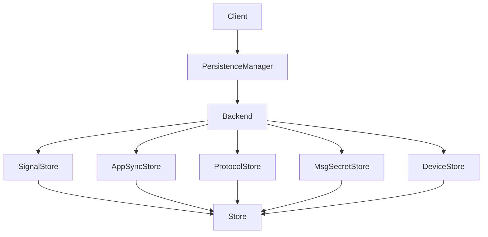

<Note>
Examples on this page target [source snapshot `ff7acad`](https://github.com/oxidezap/whatsapp-rust/tree/ff7acaddf80169013b0fd06df65296db7e4a8ca3), not a crates.io release. Use the [current API migration guide](/guides/migrating-current-api) to select the matching dependency.
</Note>

## Storage domains

The client coordinates five backend domains through `PersistenceManager`:

| Trait | Responsibility |
| --- | --- |
| `SignalStore` | Identities, sessions, pre-keys and sender keys |
| `AppSyncStore` | App-state keys, versions and mutation MACs |
| `ProtocolStore` | Protocol metadata, identity mappings and pending inbound replay |
| `MsgSecretStore` | Validated parent message secrets, event times and retention deadlines |
| `DeviceStore` | Account-scoped device state and storage operations |

A type implementing all five automatically implements `Backend`. Do not omit `MsgSecretStore` from a custom adapter.

```mermaid
graph TD
    Client --> PersistenceManager
    PersistenceManager --> Backend
    Backend --> SignalStore
    Backend --> AppSyncStore
    Backend --> ProtocolStore
    Backend --> MsgSecretStore
    Backend --> DeviceStore
    SignalStore --> Store
    AppSyncStore --> Store
    ProtocolStore --> Store
    MsgSecretStore --> Store
    DeviceStore --> Store
```

## Select account scope

Use `SqliteStore::open` for the default account or the `SqliteDatabase` facade to provision, select and enumerate accounts. An account store scopes state to its device ID. A database-wide reader or adapter has a different lifetime and scope; do not treat its resource report as an account-only measurement.

Register a concrete backend with the bot/client builder or an existing `Arc<dyn Backend>` with the corresponding `with_backend_arc` method. See [SQLite storage](/api/store#sqlitestore-implementation) and [custom backends](/guides/custom-backends).

## Change device state through the manager

The manager owns mutable device state and publishes a cached immutable snapshot. Reads use the snapshot; updates go through the manager's commands or mutation API so publication, dirty tracking and persistence ordering stay consistent. Directly changing a shared `Device` bypasses those obligations.

The implementation uses portable synchronization. Its internal fields and locks are not a second public storage API. Use the source reference for current details rather than rebuilding the manager from a copied struct definition.

## Validate stored secrets

`get_stored_msg_secret` returns a validated `MessageSecret` and the parent's optional Unix-seconds timestamp. Unknown time is `None`. A malformed persisted byte length is a typed error, not a secret to pad or truncate. The byte-only read is an explicit projection of that validated read.

`expires_at` is an independent retention deadline. A zero expiry means never; upserts keep the later deadline, with never winning. Parent timestamps use the later non-zero value and cannot be replaced by an unknown zero. See [MsgSecretStore](/api/store#msgsecretstore) and [migration](/guides/migrating-current-api#hooks-and-backend-reads).

## Preserve commit boundaries

Persist Signal changes before sending an envelope that advances their ratchets. An adapter's in-memory cache does not replace that write barrier.

For durable incoming delivery, store pending payloads and implement the protocol-store replay methods. Register an idempotent `InboundDurabilityHook` to commit application data before acknowledgement. Use `(chat, sender, id)` as the identity, since IDs alone can collide across chats or senders. A crash between the application's commit and ACK can replay an already committed message.

Read [inbound durability](/advanced/inbound-durability) for commit order, offline batches, PDO recovery and failure boundaries. The hook's live ACK gate still applies without crash replay support, but a backend that omits the durable buffer cannot offer the same restart recovery.

## Source reference

[Storage traits](https://github.com/oxidezap/whatsapp-rust/blob/ff7acaddf80169013b0fd06df65296db7e4a8ca3/wacore/src/store/traits.rs) · [PersistenceManager](https://github.com/oxidezap/whatsapp-rust/blob/ff7acaddf80169013b0fd06df65296db7e4a8ca3/src/store/persistence_manager.rs) · [SQLite adapter](https://github.com/oxidezap/whatsapp-rust/blob/ff7acaddf80169013b0fd06df65296db7e4a8ca3/storages/sqlite-storage/src/lib.rs)

## Cache coherence

Signal session/sender-key caches buffer mutations for the durable flush boundary. They are distinct from public lookup caches and cannot be discarded as a substitute for committing ratchet state. Fine-grained notification patches keep known cached metadata coherent; unknown entries or unsupported patches may require invalidation and a later fetch. See the source's cache implementation and [state management](/advanced/state-management).

LID/PN mappings preserve both addressing namespaces. Learning a mapping does not make the identities cryptographically interchangeable for an existing poll, event or encrypted add-on. Use the exact recorded creator with a creation reference, and let each facade perform its documented address resolution.

## Tune database resources

Tune `SqliteDatabaseConfig` at database scope. Reader connections can increase read concurrency under WAL while consuming their own page-cache resources; adding write concurrency does not make SQLite a multi-writer database. Use the [current SQLite configuration](/api/store#sqlitestore-implementation) and resource reports instead of old per-account pool or thread-count tables.

## Migrate persisted data

Back up the database before an incompatible format migration. Follow the [storage migration reference](/api/store) for supported migrations and legacy session interoperability. Changing a library feature does not retroactively validate arbitrary stored bytes. Do not hand-rewrite Signal sessions or drop account-scoped state to bypass an invalid-data error.
